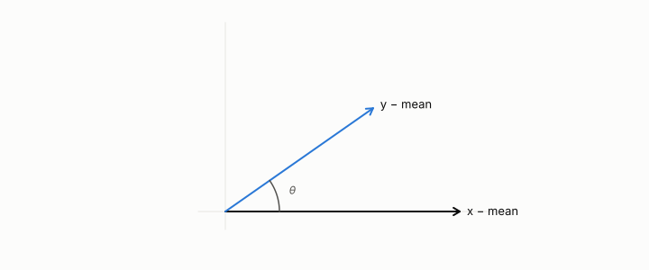

# correlation

**id.** correlation
**kind.** concept

## definition

The cosine of two centred columns, between minus one and one, unchanged by shifting or rescaling either. Its distance lives on the quotient that discards shift and scale. Chapter 0 section 0.6.

**Example.** Columns (1, 2, 3) and (2, 4, 6) have correlation 1, and (1, 2, 3) and (3, 2, 1) have correlation minus 1.

## equation

none

## conditions

- The cosine of two centred columns. It lies between minus one and one, is one for a column against itself, is symmetric, and is unchanged by shifting or positively rescaling either column, so correlation distance lives on the quotient that discards shift and scale.
- Rank correlations read the order and discard the values, and a read distortion that correlates with a downstream ranking at 0.80 is a control and not a complete rank statistic, NEG-9.

Conditions are curated in `entries.toml` rather than read from a record.

## ledger

none

## first stated

Pearson, 1895, as chapter 0 section 0.6 and chapter 3 section 3.1 of *Data Mining as Observation* read it, with the radius-against-degree correlation in `the-angular-observer/README.md:135-139`.

## measurements

| Where the book states it | Numbers, as the book's sources table records them | Source |
|---|---|---|
| chapter 3 section 3.3 | radius against degree correlation 0.92 to 0.99 | `the-angular-observer/README.md:135-139` |

## failures and corrections

none

## machine checked

[`lean/DataMiningAsObservation/Correlation.lean`](https://github.com/ahb-sjsu/observation-data-mining/blob/08b4794/lean/DataMiningAsObservation/Correlation.lean), theorems `abs_corr_le_one`, `corr_self`, `cosine_comm`, `corr_comm`, `center_shift`, `center_smul`, `corr_shift`, `corr_smul`, at observation-data-mining 08b4794; what the check covers is stated in the book's [appendix C](https://github.com/ahb-sjsu/observation-data-mining/blob/08b4794/chapters/machine_checked.md).

## used in

*Data Mining as Observation* chapters 0, 1, 2, 3, 4, 6, 7, 8, 9, 10, 11, 12, 13, 14.

## related

cosine, spearman-correlation, kendall-correlation, covariance-matrix, quotient

## see also

Book equations stated beside the entry's terms, not defining it: 0.1, 3.1, 0.18.

Ledger rows that cite the entry's records without naming it: NEG-9.

Sources-table rows that share a record with the entry without naming it: chapter 6 section 6.4, chapter 8 section 8.5.

## status

Generated 2026-09-06 by `encyclopedia/generate.py`; book at observation-data-mining 08b4794; the commit of every record is listed in the encyclopedia's provenance.
