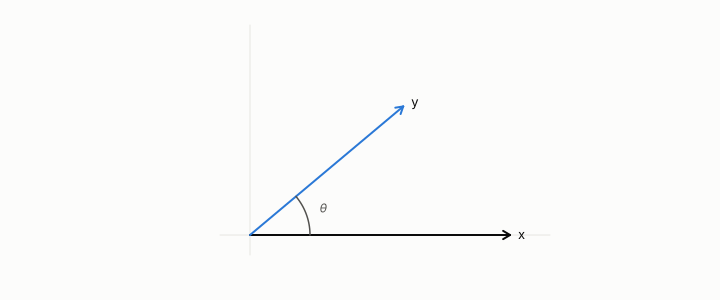

# cosine

**id.** cosine
**kind.** concept

## definition

The dot product divided by the product of the two lengths, between minus one and one, unchanged by rescaling either vector. Its distance is the angle. Equation 0.1.

**Example.** Vectors (1, 0) and (1, 1) have cosine one over root 2, about 0.707, and doubling either vector leaves it unchanged.

## equation

Book equation 0.1.

    x\cdot y=\sum_{i=1}^{d}x_i y_i,\qquad \|x\|=\sqrt{x\cdot x},\qquad \cos\theta=\frac{x\cdot y}{\|x\|\,\|y\|}.

## conditions

- The dot product divided by the product of the two lengths. By Cauchy and Schwarz it lies between minus one and one, a vector has cosine one with itself, rescaling either vector by a positive factor does not change it, and it is the dot product of the two row-normalized vectors, so its distance is the angle on the quotient that discards length.
- A reconstruction cosine of 0.995 sat beside a consumer's perplexity of ten thousand, so the cosine is never an acceptance metric for a code, and on a spectral embedding the cosine is the right similarity because the length has converged to degree noise.

Conditions are curated in `entries.toml` rather than read from a record.

## ledger

- *measures.* GO-B-legal (035→036) `[predicted]`. Legal-citation retrieval (CourtListener), cosine-ranking consumer, LaBSE embeddings — real large corpus, non-physical consumer [`geometric-observation/claims/LEDGER.md:119`](https://github.com/ahb-sjsu/geometric-observation/blob/b2626a6/claims/LEDGER.md#L119).
- *refutes or corrects.* NEG-2 `[refuted]`. Reconstruction cosine as a proxy for key quality. [`geometric-observation/claims/LEDGER.md:95`](https://github.com/ahb-sjsu/geometric-observation/blob/b2626a6/claims/LEDGER.md#L95).

## first stated

Chapter 0 section 0.1 of *Data Mining as Observation*, equation 0.1, with the program's cosine-against-consumer negative in `turboquant-pro/docs/KV_KEYS_FINDING.md:1-49`.

## measurements

| Where the book states it | Numbers, as the book's sources table records them | Source |
|---|---|---|
| chapter 1 section 1.4 | cosine 0.995 and perplexity of order ten thousand, the recalibration negative | [`geometric-observation/chapters/ch02_failure_of_observer_free_measurement.md:40-60`](https://github.com/ahb-sjsu/geometric-observation/blob/b2626a6/chapters/ch02_failure_of_observer_free_measurement.md#L40-L60); [`geometric-observation/chapters/ch16_honest_negatives.md`](https://github.com/ahb-sjsu/geometric-observation/blob/b2626a6/chapters/ch16_honest_negatives.md) NEG-2 and NEG-4; [`turboquant-pro/docs/KV_KEYS_FINDING.md:1-49`](https://github.com/ahb-sjsu/turboquant-pro/blob/856c4cb/docs/KV_KEYS_FINDING.md#L1-L49) |
| chapter 2 section 2.5 | cosine 0.995 and the softmax reader | [`turboquant-pro/docs/KV_KEYS_FINDING.md:1-49`](https://github.com/ahb-sjsu/turboquant-pro/blob/856c4cb/docs/KV_KEYS_FINDING.md#L1-L49) |
| chapter 8 section 8.2 | cosine 0.995, perplexity near 1e4 | [`turboquant-pro/docs/KV_KEYS_FINDING.md:1-49`](https://github.com/ahb-sjsu/turboquant-pro/blob/856c4cb/docs/KV_KEYS_FINDING.md#L1-L49); [`geometric-observation/chapters/ch16_honest_negatives.md`](https://github.com/ahb-sjsu/geometric-observation/blob/b2626a6/chapters/ch16_honest_negatives.md) NEG-2 |

## failures and corrections

- NEG-2, `[refuted]`. Reconstruction cosine as a proxy for key quality. [`geometric-observation/claims/LEDGER.md:95`](https://github.com/ahb-sjsu/geometric-observation/blob/b2626a6/claims/LEDGER.md#L95).

## invariance envelope

none declared

## machine checked

[`lean/DataMiningAsObservation/Cosine.lean`](https://github.com/ahb-sjsu/observation-data-mining/blob/f3914f0/lean/DataMiningAsObservation/Cosine.lean), theorems `abs_dot_le`, `cosine_le_one`, `neg_one_le_cosine`, `cosine_self`, `cosine_smul`, `cosine_eq_dot_rowNormalize`, at observation-data-mining f3914f0; what the check covers is stated in the book's [appendix C](https://github.com/ahb-sjsu/observation-data-mining/blob/f3914f0/chapters/machine_checked.md).

## used in

*Data Mining as Observation* primers L and S, chapters 0, 1, 2, 3, 6, 8, 10, 11, 12.

## related

dot-product, euclidean-distance, spectral-embedding, quotient, identity-reader

## see also

Book equations stated beside the entry's terms, not defining it: 3.1, 3.3.

Sources-table rows that share a record with the entry without naming it: chapter 3 section 3.3, chapter 9 section 9.1, chapter 11 section 11.2, chapter 12 section 12.3.

## status

Generated 2026-09-10 by `encyclopedia/generate.py`; book at observation-data-mining f3914f0; the commit of every record is listed in the encyclopedia's provenance.
