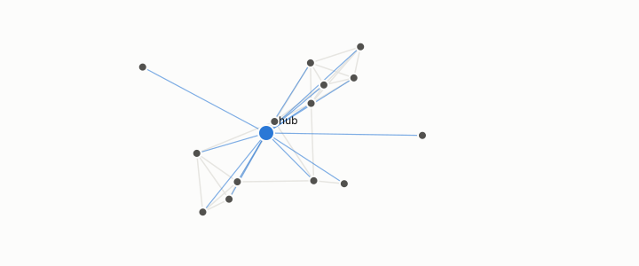

# coupling null

**id.** coupling-null
**kind.** concept

## definition

The case, alignment near one, in which the read subspace and the high-variance subspace coincide and the reconstruction-optimal code is also the read-preserving one. The flip's stated boundary. Chapter 4.

**Example.** Queries drawn from the corpus itself inflated the busiest count from about 61 to 339.9.

## equation

Book equation 4.6.

    \kappa=\operatorname{tr}\big(\bar P_C\,\bar\Sigma_x\big)\in[0,1],\qquad \kappa\to1\ \text{is the coupling null (no flip)}.

## conditions

- The coupling null is the case in which the read subspace and the high-variance subspace coincide, alignment near one, so that the reconstruction-optimal code is also the read-preserving one and no flip is possible.
- It is the flip's stated boundary, and a comparison that finds no flip there has confirmed the boundary rather than refuted the flip.

Conditions are curated in `entries.toml` rather than read from a record.

## ledger

none

## first stated

Volume 14, chapter 8, `geometric-observation/chapters/ch08_value.md:108-116`, the gradient-compression case, and chapter 12 for the alignment dial, DOI 10.5281/zenodo.21776291.

## measurements

| Where the book states it | Numbers, as the book's sources table records them | Source |
|---|---|---|
| chapter 4 section 4.4 | gradient compression anti 300 of 300, flip 27 percent, coupling boundary | [`geometric-observation/chapters/ch08_value.md:108-116`](https://github.com/ahb-sjsu/geometric-observation/blob/0792c84/chapters/ch08_value.md#L108-L116) |

## failures and corrections

none

## machine checked

[`lean/DataMiningAsObservation/Alignment.lean`](https://github.com/ahb-sjsu/observation-data-mining/blob/95af30c/lean/DataMiningAsObservation/Alignment.lean), theorems `overlap_sq_le`, `alignment_le_one`, `alignment_nonneg`, `alignment_eq_one_of_proportional`, `coupling_null`, at observation-data-mining 95af30c; what the check covers is stated in the book's [appendix C](https://github.com/ahb-sjsu/observation-data-mining/blob/95af30c/chapters/machine_checked.md).

## used in

*Data Mining as Observation* chapters 4.

## related

alignment, flip, read-distortion

## see also

Ledger rows that cite the entry's records without naming it: GO-4, GO-B-optim-D4 (034 · D4).

Sources-table rows that share a record with the entry without naming it: chapter 4 section 4.4, chapter 7 section 7.2.

## status

Generated 2026-09-07 by `encyclopedia/generate.py`; book at observation-data-mining 95af30c; the commit of every record is listed in the encyclopedia's provenance.
