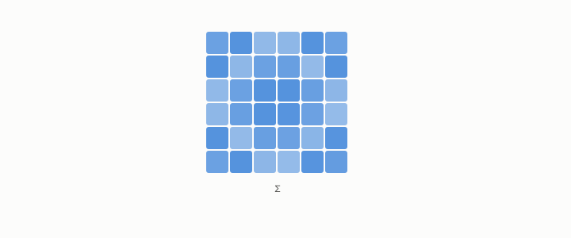

# covariance matrix

**id.** covariance-matrix
**kind.** concept

## definition

The matrix of pairwise covariances of a set of rows, whose trace is the total variance. Equation 0.3.

**Example.** Two columns with variances 0.3 and 1.7 and no covariance have covariance matrix diag(0.3, 1.7) and trace 2.0.

## equation

Book equation 0.3.

    \Sigma_{ij}=\mathbb E\big[(x_i-\mu_i)(x_j-\mu_j)\big],\qquad \operatorname{tr}\Sigma=\sum_{i}\Sigma_{ii}.

Book equation 0.5.

    \Sigma\,v_i=\lambda_i v_i,\qquad \Sigma=\sum_{i=1}^{d}\lambda_i\,v_i v_i^{\top},\qquad v_i\cdot v_j=0\ (i\ne j).

## conditions

- The weighted average of the centred rows' outer products, the same construction as the read operator with the centred row in place of the sensitivity. Its quadratic form along a unit direction is the variance of the projection onto it, its trace is the total variance, and it is positive semidefinite.
- Chapter 4 pairs it with the read operator in one basis. Where the two are proportional there is no flip, and where they are not the water-filling allocation reads both.

Conditions are curated in `entries.toml` rather than read from a record.

## ledger

- *measures.* OT-7 `[demonstrated]`. The damage form, trace pairing, rank, and loading covariance are GL(d)-invariant under `P' = A⁻ᵀPA⁻¹`, while spectrum, effective rank, principal angles, and water-filling are O(d)-only — consumer-weighted damage is a geometric scalar, and … [`geometric-observation/claims/LEDGER.md:30`](https://github.com/ahb-sjsu/geometric-observation/blob/fc6b378/claims/LEDGER.md#L30).
- *measures.* OT-2 `[predicted]`. Loading is a covariance, not a distance: reading error under a change of measure is priced by ε·‖E[h·A]‖ — predicted from the base measure alone — and a full-magnitude shift orthogonal to the operator's variation does nothing. [`geometric-observation/claims/LEDGER.md:33`](https://github.com/ahb-sjsu/geometric-observation/blob/fc6b378/claims/LEDGER.md#L33).

## first stated

Chapter 0 section 0.2 of *Data Mining as Observation*, paired with the read operator in chapter 4, and Volume 14 chapter 5, `geometric-observation/chapters/ch05_the_read_metric_and_the_quotient.md:7-48`.

## measurements

none

## failures and corrections

none

## invariance envelope

none declared

## machine checked

[`lean/DataMiningAsObservation/Covariance.lean`](https://github.com/ahb-sjsu/observation-data-mining/blob/c149a10/lean/DataMiningAsObservation/Covariance.lean), theorems `var_eq_quad`, `trace_eq_total`, `quad_nonneg`, `cov_symm`, at observation-data-mining c149a10; what the check covers is stated in the book's [appendix C](https://github.com/ahb-sjsu/observation-data-mining/blob/c149a10/chapters/machine_checked.md).

## used in

*Data Mining as Observation* chapters 0, 1, 2, 3, 4, 9, 10, 11, 12.

## related

read-operator, whitening, water-filling, alignment, explained-variance

## see also

Book equations stated beside the entry's terms, not defining it: 0.4.

Sources-table rows that share a record with the entry without naming it: chapter 2 section 2.2, chapter 4 section 4.2.

## status

Generated 2026-09-09 by `encyclopedia/generate.py`; book at observation-data-mining c149a10; the commit of every record is listed in the encyclopedia's provenance.
