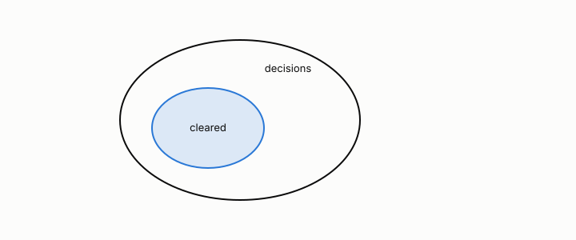

# coverage

**id.** coverage
**kind.** concept

## definition

The fraction of decisions a certificate clears, reported beside its false-clear rate, since a certificate that clears nothing has a false-clear rate of zero and no use. Equation 0.26.

**Example.** A certificate that clears 500 of 1000 decisions has coverage one half.

## equation

Book equation 0.26.

    \mathrm{FC}=\Pr\big[W\ \text{refutes}\ \big|\ \mathcal C_t\ \text{clears}\big],\qquad \text{coverage}=\Pr\big[\mathcal C_t\ \text{clears}\big].

## conditions

- A naive certificate clears every decision, so its coverage is one and its conditional and joint false-clear rates coincide.
- A witnessed certificate clears fewer decisions, and its false-clear rate is read beside its coverage, never alone.
- The word also names, in chapter 14, what a moderation instrument can read of the signal its inputs carry, which is a different quantity and is not this entry.

Conditions are curated in `entries.toml` rather than read from a record.

## ledger

none

## first stated

*Data Mining as Observation*, chapter 0 section 0.13 and chapter 13, introduced on 2026-09-03 when the false-clear rate was restated as a conditional rate, and Volume 14 chapter 19 at geometric-observation 7d91883.

## measurements

none

## failures and corrections

none

## invariance envelope

none declared

## machine checked

[`lean/DataMiningAsObservation/Certificate.lean`](https://github.com/ahb-sjsu/observation-data-mining/blob/95af30c/lean/DataMiningAsObservation/Certificate.lean), theorems `falseClear_mul_coverage`, `coverage_empty`, `falseClear_mem_unit`, `minOverStrata_passes_iff`, `minOverStrata_le_weighted_mean`, at observation-data-mining 95af30c; what the check covers is stated in the book's [appendix C](https://github.com/ahb-sjsu/observation-data-mining/blob/95af30c/chapters/machine_checked.md).

## used in

*Data Mining as Observation* chapters 0, 10, 12, 13, 14.

## related

false-clear-rate, certificate, witness

## see also

Sources-table rows that share a record with the entry without naming it: chapter 12 section 12.6, chapter 13 section 13.3.

## status

Generated 2026-09-08 by `encyclopedia/generate.py`; book at observation-data-mining 95af30c; the commit of every record is listed in the encyclopedia's provenance.
