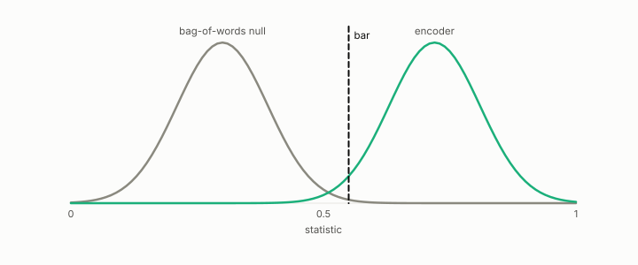

# cross-corpus gate

**id.** cross-corpus-gate
**kind.** instrument

## definition

The validation rule that an encoder votes only if its held-out AUROC on a corpus it was not trained on clears a preregistered margin over a bag-of-words null. Chapters 12 and 14.

**Example.** The rights encoder needed a margin of 0.10 over a bag-of-words null on a corpus it never saw; it scored 0.509 against the null's 0.512 and failed.

## equation

Book equation 12.3.

    \text{validated}\iff \mathrm{AUROC}_{\text{cross}}-\max\big(\mathrm{AUROC}_{\text{untrained}},\ \mathrm{AUROC}_{\text{BoW}}\big)\ \ge\ 0.10.

## conditions

- An encoder votes only if its held-out AUROC on a corpus it was not trained on clears both nulls, the untrained encoder and the bag-of-words baseline, by the preregistered margin of one tenth. A validated encoder therefore beats each null by the margin.
- Since AUROC is at most one, a null above nine tenths cannot be cleared by any encoder, and the gate's verdict is unchanged by any strictly monotone recalibration of the score.
- The rights encoder fell below the untrained baseline and was retired rather than tuned, and the within-corpus scores that had collapsed on a second corpus were the reason the gate is cross-corpus.
- The gate compares the AUROC as the encoder orients its score, so a reversed encoder fails rather than passing at 1 minus A, and the bag-of-words null is scored the same way.

Conditions are curated in `entries.toml` rather than read from a record.

## ledger

none

## first stated

The moral-embedding program, `xbse/README.md:104-130,160-172`, and chapter 12 section 12.5 and chapter 14 section 14.2 of *Data Mining as Observation*.

## measurements

| Where the book states it | Numbers, as the book's sources table records them | Source |
|---|---|---|
| chapter 8 section 8.6 | rights encoder 0.467 below untrained baseline, the AUROC lesson, cross-corpus same-sign fix | `xbse/README.md:160-172`; `xbse/experiments/rights_r6_summary.json` |
| chapter 12 section 12.5 | within 0.75 to 0.955 collapsing to 0.47 to 0.55, cross-corpus positives as the fix, adversary not load-bearing | `xbse\README.md:104-130,160-172` |

## failures and corrections

none

## machine checked

[`lean/DataMiningAsObservation/CrossCorpusGate.lean`](https://github.com/ahb-sjsu/observation-data-mining/blob/95af30c/lean/DataMiningAsObservation/CrossCorpusGate.lean), theorems `clears_bow`, `clears_untrained`, `not_validated_of_saturated`, `margin_example`, `validated_comp`, at observation-data-mining 95af30c; what the check covers is stated in the book's [appendix C](https://github.com/ahb-sjsu/observation-data-mining/blob/95af30c/chapters/machine_checked.md).

## used in

*Data Mining as Observation* chapters 8, 12, 14.

## related

reliability-weight, harness, leakage, preregistration

## see also

Book equations stated beside the entry's terms, not defining it: 0.16.

## status

Generated 2026-09-07 by `encyclopedia/generate.py`; book at observation-data-mining 95af30c; the commit of every record is listed in the encyclopedia's provenance.
