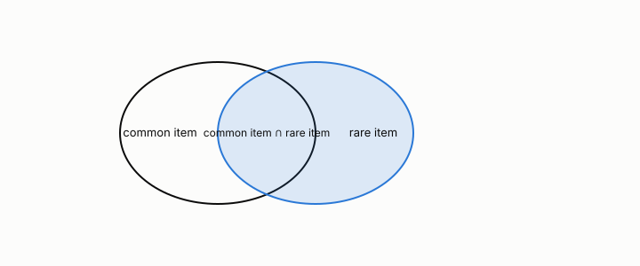

# cross-support ratio

**id.** cross-support-ratio
**kind.** concept

## definition

The smallest item support in an itemset over the largest, with a threshold below which the itemset is discarded. Chapter 5.

**Example.** An item in 2 percent of baskets paired with one in 40 percent has cross-support ratio 0.05.

## equation

none

## conditions

- The smallest item support in an itemset over the largest. It lies in the unit interval, is one exactly when every item has the same support, and adding an item can only lower it, so a threshold on it prunes supersets safely in chapter 5's sense.
- It is a property of the item supports alone and says nothing about the itemset's own support, so it discards an itemset for pairing a common item with a rare one, not for being rare.

Conditions are curated in `entries.toml` rather than read from a record.

## ledger

none

## first stated

TSK chapter 5 on cross-support patterns, as chapter 5 section 5.5 of *Data Mining as Observation* states it.

## measurements

| Where the book states it | Numbers, as the book's sources table records them | Source |
|---|---|---|
| chapter 5 section 5.1 to 5.3, 5.5 | support, confidence, lift, the Apriori principle, FP-growth, closed and maximal itemsets, objective measures, Simpson's paradox, cross-support | TSK 2e chapter 5 |

## failures and corrections

none

## invariance envelope

none declared

## machine checked

[`lean/DataMiningAsObservation/CrossSupport.lean`](https://github.com/ahb-sjsu/observation-data-mining/blob/a0db6a8/lean/DataMiningAsObservation/CrossSupport.lean), theorems `ratio_mem_unit`, `ratio_eq_one_iff`, `ratio_anti`, at observation-data-mining a0db6a8; what the check covers is stated in the book's [appendix C](https://github.com/ahb-sjsu/observation-data-mining/blob/a0db6a8/chapters/machine_checked.md).

## used in

*Data Mining as Observation* chapters 5.

## related

apriori, safe-pruning, lift, multiple-comparisons

## see also

Book equations stated beside the entry's terms, not defining it: 5.3, 5.1.

## status

Generated 2026-09-09 by `encyclopedia/generate.py`; book at observation-data-mining a0db6a8; the commit of every record is listed in the encyclopedia's provenance.
