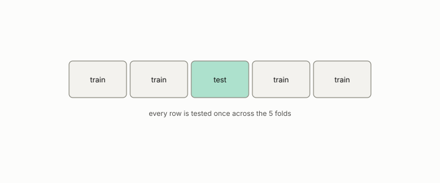

# cross-validation

**id.** cross-validation
**kind.** instrument

## definition

Splitting the data into folds and evaluating on each fold a model trained on the others. Repeated cross-validation multiplies confidence it did not earn, chapter 8 section 8.5.

**Example.** Ten folds of 100 rows each test every row once, and the overall accuracy is the mean of the ten fold accuracies.

## equation

Book equation 8.2.

    \begin{gathered} \widehat{\operatorname{Var}}_{\mathrm{NB}}=\Big(\frac1J+\frac{n_{\mathrm{test}}}{n_{\mathrm{train}}}\Big)\hat\sigma^{2}, \\ J=1000,\ \frac{n_{\mathrm{test}}}{n_{\mathrm{train}}}=\frac14\ \Rightarrow\ 1+250=251,\ \ \sqrt{251}=15.84. \end{gathered}

Book equation 0.18.

    \widehat{\operatorname{Var}}_{\mathrm{NB}}=\Big(\frac1J+\frac{n_{\mathrm{test}}}{n_{\mathrm{train}}}\Big)\hat\sigma^{2},\qquad \frac{\widehat{\operatorname{Var}}_{\mathrm{NB}}}{\hat\sigma^{2}/J}=1+J\,\frac{n_{\mathrm{test}}}{n_{\mathrm{train}}}.

## conditions

- Splitting the rows into folds and evaluating on each fold a model trained on the others, so every row is tested exactly once. The overall accuracy is the size-weighted mean of the fold accuracies, and with equal folds it is their plain mean.
- The folds share training data, so repeated cross-validation multiplies confidence it did not earn, which the Nadeau and Bengio correction prices at one plus the fold count times the test-to-train ratio.

Conditions are curated in `entries.toml` rather than read from a record.

## ledger

none

## first stated

Stone, cross-validatory choice, 1974, as chapter 8 section 8.5 of *Data Mining as Observation* reads it, with the program's fold accounting in `constraint-gap/review/FINDINGS.md:1-35`.

## measurements

none

## failures and corrections

none

## invariance envelope

none declared

## machine checked

[`lean/DataMiningAsObservation/CrossValidation.lean`](https://github.com/ahb-sjsu/observation-data-mining/blob/f3914f0/lean/DataMiningAsObservation/CrossValidation.lean), theorems `sizes_sum`, `accuracy_weighted`, `accuracy_mean_of_equal`, at observation-data-mining f3914f0; what the check covers is stated in the book's [appendix C](https://github.com/ahb-sjsu/observation-data-mining/blob/f3914f0/chapters/machine_checked.md).

## used in

*Data Mining as Observation* primer S, chapters 0, 1, 2, 4, 5, 6, 7, 8, 14.

## related

nadeau-and-bengio-correction, harness, standard-error, leakage

## see also

Sources-table rows that share a record with the entry without naming it: chapter 6 section 6.4, chapter 8 section 8.5.

## status

Generated 2026-09-12 by `encyclopedia/generate.py`; book at observation-data-mining f3914f0; the commit of every record is listed in the encyclopedia's provenance.
