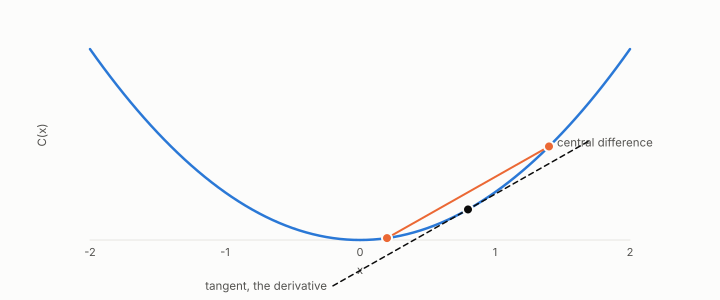

# curvature

**id.** curvature
**kind.** concept

## definition

The second derivative of a consumer, which the finite difference of equation 0.8 does not read and which sets the error of the linear model at a step. Chapter 0 section 0.5 and chapter 7 section 7.2.

**Example.** For C(x) equal to x squared, the central difference at 0.8 with step 0.6 gives exactly 1.6, and the one-sided difference gives 2.2.

## equation

Book equation 0.8.

    g_j\;\approx\;\frac{C(x+h\,e_j)-C(x-h\,e_j)}{2h},\qquad j=1,\dots,d.

## conditions

- The second derivative of a consumer, which the finite difference of equation 0.8 does not read. For a quadratic the second difference recovers it exactly at every step, the error of the linear model at a step is the curvature times the step squared, and the gradient at the two ends of a step differs by the curvature times the step. An affine consumer has none.
- The reader of a gradient is the optimizer, and its read operator is the loss curvature, which chapter 4's flip was measured against on a real logistic model with its exact Hessian, anti three hundred of three hundred and the flip in 82 of 300.

Conditions are curated in `entries.toml` rather than read from a record.

## ledger

- *measures.* GO-B-optim-D4 (034 · D4) `[predicted]`. Optimization — gradient compression, curvature (Hessian) read operator, on a REAL model (logistic regression); optional stretch [`geometric-observation/claims/LEDGER.md:122`](https://github.com/ahb-sjsu/geometric-observation/blob/fc6b378/claims/LEDGER.md#L122).

## first stated

Chapter 0 section 0.5 and chapter 7 section 7.2 of *Data Mining as Observation*, with the curvature reader's flip in `geometric-observation/claims/LEDGER.md` row GO-B-optim-D4.

## measurements

| Where the book states it | Numbers, as the book's sources table records them | Source |
|---|---|---|
| chapter 7 section 7.2 | second-order leaf values, logistic curvature | ESL 2e 10.9 to 10.13; XGBoost introduction to boosted trees |

## failures and corrections

none

## invariance envelope

none declared

## machine checked

[`lean/DataMiningAsObservation/Curvature.lean`](https://github.com/ahb-sjsu/observation-data-mining/blob/6aebdf3/lean/DataMiningAsObservation/Curvature.lean), theorems `second_quad`, `second_affine`, `linear_error`, `gradient_change`, at observation-data-mining 6aebdf3; what the check covers is stated in the book's [appendix C](https://github.com/ahb-sjsu/observation-data-mining/blob/6aebdf3/chapters/machine_checked.md).

## used in

*Data Mining as Observation* chapters 0, 3, 4, 7.

## related

hessian, finite-difference, sensitivity, boosting, read-operator

## see also

Book equations stated beside the entry's terms, not defining it: 0.9, 6.1.

Sources-table rows that share a record with the entry without naming it: chapter 7 section 7.2.

## status

Generated 2026-09-09 by `encyclopedia/generate.py`; book at observation-data-mining 6aebdf3; the commit of every record is listed in the encyclopedia's provenance.
