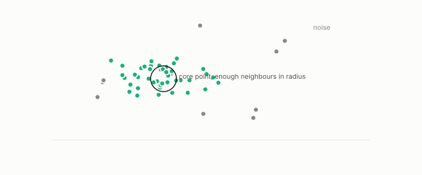

# DBSCAN

**id.** dbscan
**kind.** instrument

## definition

A clustering that calls a point a core point when at least a minimum number of points lie within a radius, grows clusters by reachability from core points, and leaves the rest as noise. Chapter 9.

**Example.** With radius 0.5 and a minimum of 4 neighbours, a point with 6 neighbours within 0.5 is a core point and a point with none is noise.

## equation

Book equation 9.1.

    \mathrm{SSE}=\sum_{k=1}^{K}\sum_{i\in\mathcal C_k}\|x_i-c_k\|^{2},\qquad\text{the }P_C=I\text{ distortion summed within clusters}.

## conditions

- A clustering that calls a point a core point when at least a minimum number of points lie within a radius, grows a cluster by reachability from core points, and leaves the rest as noise. A wider radius or a smaller count makes more core points, every reachability chain starts at a core point, and a point that is not a core point reaches nothing.
- Its read subspace is the density coordinate, the one the geodesic reader of a spectral embedding discards, so two clustering consumers of one embedding read complementary coordinates.

Conditions are curated in `entries.toml` rather than read from a record.

## ledger

none

## first stated

Ester, Kriegel, Sander, and Xu, a density-based algorithm for discovering clusters, 1996, as chapter 9 section 9.1 of *Data Mining as Observation* reads it.

## measurements

none

## failures and corrections

none

## invariance envelope

none declared

## machine checked

[`lean/DataMiningAsObservation/Dbscan.lean`](https://github.com/ahb-sjsu/observation-data-mining/blob/95af30c/lean/DataMiningAsObservation/Dbscan.lean), theorems `ball_mono`, `core_mono`, `core_anti`, `reach_from_core`, `noise_unreachable`, at observation-data-mining 95af30c; what the check covers is stated in the book's [appendix C](https://github.com/ahb-sjsu/observation-data-mining/blob/95af30c/chapters/machine_checked.md).

## used in

*Data Mining as Observation* chapters 9, 10.

## related

density, k-means, hierarchical-clustering, spectral-clustering, outlier

## see also

Book equations stated beside the entry's terms, not defining it: 0.19, 10.3.

Ledger rows that cite the entry's records without naming it: NEG-11.

Sources-table rows that share a record with the entry without naming it: chapter 9 section 9.1, chapter 10 section 10.1.

## status

Generated 2026-09-09 by `encyclopedia/generate.py`; book at observation-data-mining 95af30c; the commit of every record is listed in the encyclopedia's provenance.
