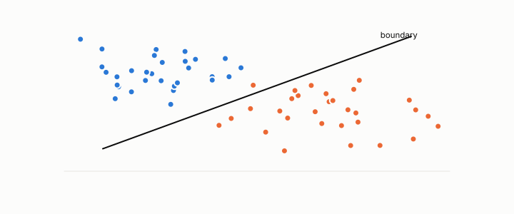

# decision boundary

**id.** decision-boundary
**kind.** concept

## definition

The set of inputs whose score equals the threshold. Chapter 6.

**Example.** For the score 2x1 + x2 − 3 at threshold zero, the boundary is the line 2x1 + x2 = 3.

## equation

none

## conditions

- The set of inputs whose score equals the threshold. For a linear classifier it is an affine hyperplane. Moving orthogonally to the weights never crosses it, moving along the weights crosses it exactly once, and every boundary point has the same projection on the weights.
- The boundary is where the read direction and the threshold meet and nothing else about the input enters it, which is the classifier's nuisance drawn as a picture.

Conditions are curated in `entries.toml` rather than read from a record.

## ledger

none

## first stated

Chapter 6 section 6.1 of *Data Mining as Observation*, where the classifier's read direction and its threshold meet.

## measurements

none

## failures and corrections

none

## invariance envelope

none declared

## machine checked

[`lean/DataMiningAsObservation/DecisionBoundary.lean`](https://github.com/ahb-sjsu/observation-data-mining/blob/f3914f0/lean/DataMiningAsObservation/DecisionBoundary.lean), theorems `orth_stays`, `cross_once`, `same_projection`, at observation-data-mining f3914f0; what the check covers is stated in the book's [appendix C](https://github.com/ahb-sjsu/observation-data-mining/blob/f3914f0/chapters/machine_checked.md).

## used in

*Data Mining as Observation* chapters 0.

## related

classifier, threshold, margin, nuisance

## see also

Book equations stated beside the entry's terms, not defining it: 6.1, 6.2.

Ledger rows that cite the entry's records without naming it: GO-1.

## status

Generated 2026-09-10 by `encyclopedia/generate.py`; book at observation-data-mining f3914f0; the commit of every record is listed in the encyclopedia's provenance.
