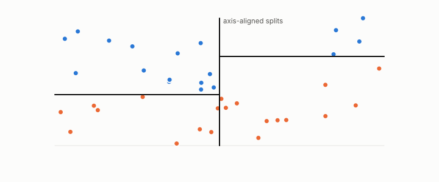

# decision tree

**id.** decision-tree
**kind.** instrument

## definition

A classifier that scores by a sequence of axis-aligned splits, flat within each leaf, so that its sensitivity is zero almost everywhere and its importances count splits. Chapter 6.

**Example.** Split on x1 below 5, then on x2 below 4 in the left branch; a row at x1 equal to 5.1 lands in the right leaf whatever x2 is.

## equation

none

## conditions

- A classifier that scores by a sequence of axis-aligned splits and is flat within each leaf. Its finite difference is zero at every row that does not straddle a split, a split on one coordinate reads nothing of the others, and the Gini impurity it splits on is at most one half for two classes and zero exactly for a pure leaf.
- Its read subspace is spanned by the coordinates it splits on and a feature that appears in no split is in its nuisance exactly, which is why a finite-difference probe of a tree returns zero at most rows and importances that count splits are the right sensitivity for this reader.

Conditions are curated in `entries.toml` rather than read from a record.

## ledger

none

## first stated

Breiman, Friedman, Olshen, and Stone, classification and regression trees, 1984, as chapter 6 section 6.1 of *Data Mining as Observation* reads it, with the selection-consumer regime in `readscope/readscope/regimes.py:1-60`.

## measurements

none

## failures and corrections

none

## invariance envelope

none declared

## machine checked

[`lean/DataMiningAsObservation/DecisionTree.lean`](https://github.com/ahb-sjsu/observation-data-mining/blob/f3914f0/lean/DataMiningAsObservation/DecisionTree.lean), theorems `stump_flat_left`, `stump_flat_right`, `split_reads_one_axis`, `gini_le_half`, `gini_eq_zero_iff`, at observation-data-mining f3914f0; what the check covers is stated in the book's [appendix C](https://github.com/ahb-sjsu/observation-data-mining/blob/f3914f0/chapters/machine_checked.md).

## used in

*Data Mining as Observation* chapters 0, 4, 5, 6, 7, 8, 9, 11, 14.

## related

classifier, importance, boosting, ensemble, sensitivity

## see also

Book equations stated beside the entry's terms, not defining it: 6.1, 0.8, 14.5.

Ledger rows that cite the entry's records without naming it: GO-1.

Sources-table rows that share a record with the entry without naming it: chapter 2 section 2.3, chapter 6 section 6.1, chapter 6 section 6.3, chapter 7 section 7.3.

## status

Generated 2026-09-10 by `encyclopedia/generate.py`; book at observation-data-mining f3914f0; the commit of every record is listed in the encyclopedia's provenance.
