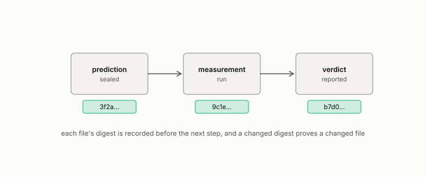

# declaration

**id.** declaration
**kind.** instrument

## definition

A sealed statement of what a study will count, drop, or treat as a failure, written before the run. Chapter 8 section 8.8.

**Example.** The declaration named timeouts and numerical failures as counted trajectories before the run, and one count was corrected the next day.

## equation

none

## conditions

- A statement of what a study will count, drop, or treat as a failure, sealed before the run. A changed digest would prove a changed declaration, and a declaration drafted on one day and sealed the next is the record's normal shape.
- The declaration for the fourth crucible was drafted 2026-08-17, sealed 2026-08-18, and had one count corrected, and the missing-data rule is a required declared field.
- The declaration's chronology rests on the seal's public receipt, signed tag, or archival deposit, since a commit's dates are supplied fields.

Conditions are curated in `entries.toml` rather than read from a record.

## ledger

none

## first stated

Chapter 8 section 8.8 of *Data Mining as Observation*, with the sealed declaration in `geometric-observation/crucible/DECLARATION-V1.md:1-20`.

## measurements

| Where the book states it | Numbers, as the book's sources table records them | Source |
|---|---|---|
| chapter 8 section 8.8 | declaration drafted 2026-08-17, sealed 2026-08-18, one count corrected, G2 | [`geometric-observation/crucible/DECLARATION-V1.md:1-20`](https://github.com/ahb-sjsu/geometric-observation/blob/b2626a6/crucible/DECLARATION-V1.md#L1-L20); [`geometric-observation/crucible/OT-CRUCIBLE-4.md:31-35`](https://github.com/ahb-sjsu/geometric-observation/blob/b2626a6/crucible/OT-CRUCIBLE-4.md#L31-L35) |

## failures and corrections

none

## invariance envelope

none declared

## machine checked

[`lean/DataMiningAsObservation/Seal.lean`](https://github.com/ahb-sjsu/observation-data-mining/blob/f3914f0/lean/DataMiningAsObservation/Seal.lean), theorems `changed_of_hash_ne`, `hash_eq_of_eq`, `exists_collision`, at observation-data-mining f3914f0; what the check covers is stated in the book's [appendix C](https://github.com/ahb-sjsu/observation-data-mining/blob/f3914f0/chapters/machine_checked.md).

## used in

*Data Mining as Observation* chapters 0, 2, 7, 8, 10, 11, 12.

## related

registered, sealed, preregistration, missingness, commit-hash

## see also

Book equations stated beside the entry's terms, not defining it: 8.1, 8.3.

Ledger rows that cite the entry's records without naming it: OT-11.

Sources-table rows that share a record with the entry without naming it: chapter 2 section 2.3.

## status

Generated 2026-09-12 by `encyclopedia/generate.py`; book at observation-data-mining f3914f0; the commit of every record is listed in the encyclopedia's provenance.
