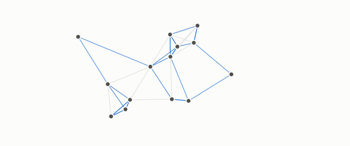

# degree

**id.** degree
**kind.** concept

## definition

Of a node in a graph, the number of edges it has. Chapter 0 section 0.10.

**Example.** A node with edges to three others has degree 3, and the degrees of a graph sum to twice its edge count.

## equation

Book equation 0.19.

    L=I-D^{-1/2}AD^{-1/2},\qquad D=\operatorname{diag}(d_1,\dots,d_n),\qquad L\,u_k=\lambda_k u_k,\ \ 0=\lambda_1\le\lambda_2\le\cdots.

Book equation 3.3.

    X_i=r_i\,\theta_i,\qquad r_i\ \to\ \frac1{\sqrt{d_i}},\qquad \theta_i=\frac{X_i}{\|X_i\|}\in S^{m-1}.

## conditions

- The number of edges a node has. Summed over the graph the degrees count every edge twice, the sum is even, and no node has degree more than the number of other nodes.
- The radius of a spectral embedding tracks the degree at correlation 0.92 to 0.99 on the substrates tested, which is the measured half of chapter 3's claim that the magnitude is degree noise and the angle is what the geodesic-rank reader reads.

Conditions are curated in `entries.toml` rather than read from a record.

## ledger

none

## first stated

Chapter 0 section 0.10 and chapter 3 section 3.3 of *Data Mining as Observation*, with the radius-against-degree measurement in the-angular-observer, `the-angular-observer/README.md:135-139`.

## measurements

| Where the book states it | Numbers, as the book's sources table records them | Source |
|---|---|---|
| chapter 3 section 3.3 | radius against degree correlation 0.92 to 0.99 | `the-angular-observer/README.md:135-139` |

## failures and corrections

none

## invariance envelope

none declared

## machine checked

[`lean/DataMiningAsObservation/Degree.lean`](https://github.com/ahb-sjsu/observation-data-mining/blob/c149a10/lean/DataMiningAsObservation/Degree.lean), theorems `sum_degrees`, `degree_lt_card`, `sum_degrees_even`, `average_degree`, at observation-data-mining c149a10; what the check covers is stated in the book's [appendix C](https://github.com/ahb-sjsu/observation-data-mining/blob/c149a10/chapters/machine_checked.md).

## used in

*Data Mining as Observation* chapters 0, 1, 3, 4, 8, 9.

## related

laplacian, geodesic-distance, hubness, recognizer

## see also

Ledger rows that cite the entry's records without naming it: NEG-1.

Sources-table rows that share a record with the entry without naming it: chapter 3 section 3.2, chapter 3 section 3.3, chapter 9 section 9.1, chapter 9 section 9.2, chapter 11 section 11.1.

## status

Generated 2026-09-09 by `encyclopedia/generate.py`; book at observation-data-mining c149a10; the commit of every record is listed in the encyclopedia's provenance.
