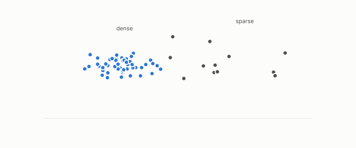

# density

**id.** density
**kind.** concept

## definition

The local crowding of rows around a point, the coordinate the geodesic reader of a spectral embedding discards and DBSCAN and the density detector read. Chapter 3 section 3.3 and chapter 9.

**Example.** A point with 20 neighbours within radius 1 sits in a denser region than one with 2.

## equation

Book equation 3.3.

    X_i=r_i\,\theta_i,\qquad r_i\ \to\ \frac1{\sqrt{d_i}},\qquad \theta_i=\frac{X_i}{\|X_i\|}\in S^{m-1}.

## conditions

- The local crowding of rows around a point, which on a neighbourhood graph is the degree. The radius of the spectral embedding converges to one over the square root of the degree, so the geodesic reader discards the density and DBSCAN and the density detector read it. A wider radius or a smaller count makes more core points, and the sum of degrees is twice the edge count.
- The radius-against-degree correlation was 0.92 to 0.99 across substrates, and the quotient that removed density to restore invariant fidelity was refuted four times, NEG-11.

Conditions are curated in `entries.toml` rather than read from a record.

## ledger

- *refutes or corrects.* NEG-11 `[refuted]`. (GO-5, prospective ×4) The α=1 density/hubness quotient decisively and density-specifically restores invariant fidelity in a non-spectral domain. [`geometric-observation/claims/LEDGER.md:104`](https://github.com/ahb-sjsu/geometric-observation/blob/0792c84/claims/LEDGER.md#L104).

## first stated

Chapter 3 section 3.3 of *Data Mining as Observation*, with the radius-against-degree measurement in `the-angular-observer/README.md:135-139`.

## measurements

none

## failures and corrections

- NEG-11, `[refuted]`. (GO-5, prospective ×4) The α=1 density/hubness quotient decisively and density-specifically restores invariant fidelity in a non-spectral domain. [`geometric-observation/claims/LEDGER.md:104`](https://github.com/ahb-sjsu/geometric-observation/blob/0792c84/claims/LEDGER.md#L104).

## invariance envelope

none declared

## machine checked

[`lean/DataMiningAsObservation/Dbscan.lean`](https://github.com/ahb-sjsu/observation-data-mining/blob/95af30c/lean/DataMiningAsObservation/Dbscan.lean), theorems `ball_mono`, `core_mono`, `core_anti`, `reach_from_core`, `noise_unreachable`, at observation-data-mining 95af30c; what the check covers is stated in the book's [appendix C](https://github.com/ahb-sjsu/observation-data-mining/blob/95af30c/chapters/machine_checked.md).

[`lean/DataMiningAsObservation/Degree.lean`](https://github.com/ahb-sjsu/observation-data-mining/blob/95af30c/lean/DataMiningAsObservation/Degree.lean), theorems `sum_degrees`, `degree_lt_card`, `sum_degrees_even`, `average_degree`, at observation-data-mining 95af30c; what the check covers is stated in the book's [appendix C](https://github.com/ahb-sjsu/observation-data-mining/blob/95af30c/chapters/machine_checked.md).

## used in

*Data Mining as Observation* chapters 3, 8, 9, 10, 11.

## related

degree, spectral-embedding, dbscan, geodesic-distance, hubness

## see also

Book equations stated beside the entry's terms, not defining it: 0.19, 9.1.

Ledger rows that cite the entry's records without naming it: NEG-1.

Sources-table rows that share a record with the entry without naming it: chapter 3 section 3.3, chapter 9 section 9.1, chapter 10 section 10.1.

## status

Generated 2026-09-08 by `encyclopedia/generate.py`; book at observation-data-mining 95af30c; the commit of every record is listed in the encyclopedia's provenance.
