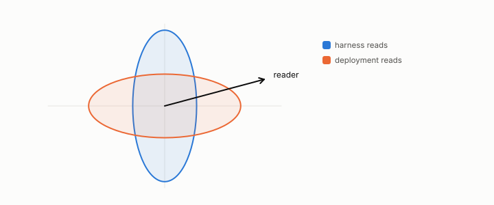

# deployment mismatch

**id.** deployment-mismatch
**kind.** concept

## definition

The failure in which the consumer that was evaluated is not the consumer that was deployed, or time moved between the two. Chapters 1 and 13.

**Example.** The harness read a direction the deployed consumer never sees, and its 0.909 became 0.736 in deployment.

## equation

none

## conditions

- The failure in which the consumer that was evaluated is not the consumer that was deployed, or time moved between the two. A deployment score is a weighted mean over the slices actually served, so it lies between the worst slice and the best, and a benchmark drawn from the best slice overstates it unless every weighted slice matches.
- The chapter's case scores 0.909 on the benchmark against a target of 0.8 and 0.736 on the deployment mean, and the six bars that separate the two are preregistered.

Conditions are curated in `entries.toml` rather than read from a record.

## ledger

none

## first stated

Chapter 1 section 1.7 and chapter 13 of *Data Mining as Observation*, with the program's case in the radio slice sweep, `observation-theory-campaigns/analysis/llm/PREREG-XPROTO-LLM.md`, and the serving-stack measurement of ledger row GO-2/GO-12/GO-13 operational.

## measurements

| Where the book states it | Numbers, as the book's sources table records them | Source |
|---|---|---|
| chapter 12 section 12.6 | XPROTO-LLM, benchmark 0.909, 0.920, 0.909, thirty slices, target 0.8, naive 0.333, aware 0.033, spread 0.380, deployment mean 0.736, six bars on three seeds, sealed 2026-08-25 at b61f7f1 | [`observation-theory-campaigns/experiments/LLM-EVAL-TRACK.md:1-50`](https://github.com/ahb-sjsu/observation-theory-campaigns/blob/f6d1fe2/experiments/LLM-EVAL-TRACK.md#L1-L50); [`observation-theory-campaigns/analysis/llm/XPROTO-LLM-graded.json`](https://github.com/ahb-sjsu/observation-theory-campaigns/blob/f6d1fe2/analysis/llm/XPROTO-LLM-graded.json); [`observation-theory-campaigns/experiments/SEALS.md:85`](https://github.com/ahb-sjsu/observation-theory-campaigns/blob/f6d1fe2/experiments/SEALS.md#L85) |

## failures and corrections

none

## machine checked

[`lean/DataMiningAsObservation/DeploymentMismatch.lean`](https://github.com/ahb-sjsu/observation-data-mining/blob/95af30c/lean/DataMiningAsObservation/DeploymentMismatch.lean), theorems `deployment_le_max`, `min_le_deployment`, `deployment_lt_max_of_gap`, `book_numbers`, at observation-data-mining 95af30c; what the check covers is stated in the book's [appendix C](https://github.com/ahb-sjsu/observation-data-mining/blob/95af30c/chapters/machine_checked.md).

## used in

*Data Mining as Observation* chapters 1, 12.

## related

observer, certificate, coherence-time, min-over-strata

## see also

Book equations stated beside the entry's terms, not defining it: 13.1.

Ledger rows that cite the entry's records without naming it: OT-4, GO-2/GO-12/GO-13 operational (KV serving, 077).

Sources-table rows that share a record with the entry without naming it: chapter 13 section 13.6.

## status

Generated 2026-09-07 by `encyclopedia/generate.py`; book at observation-data-mining 95af30c; the commit of every record is listed in the encyclopedia's provenance.
