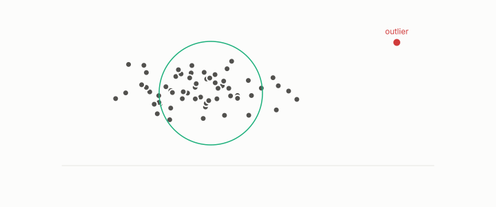

# detector

**id.** detector
**kind.** instrument

## definition

A scorer that calls a row an outlier, of four families reading distance from the mean, distance to neighbours, density relative to neighbours, or cluster membership. Chapter 10 section 10.1.

**Example.** A row 3.6 spreads from the mean is an outlier to the statistical detector and may be ordinary to the density detector.

## equation

none

## conditions

- A scorer that calls a row an outlier, of four families. The statistical detector reads distance from the mean in units of spread, the proximity detector reads distance to neighbours, the density detector reads density relative to neighbours, and the clustering detector reads membership. Each reads a coordinate the others discard.
- No detector of the data alone sees the observer's outliers, the anti-hubs, because they are a property of the queries, and a detector's positives are few by Chebyshev's arithmetic.

Conditions are curated in `entries.toml` rather than read from a record.

## ledger

none

## first stated

Chapter 10 section 10.1 of *Data Mining as Observation*, after TSK chapter 9, with the hierarchical typing in `turboquant-pro/turboquant_pro/anatomy.py:98-170`.

## measurements

| Where the book states it | Numbers, as the book's sources table records them | Source |
|---|---|---|
| chapter 10 section 10.1 | the four detector families | TSK 2e chapter 9 |

## failures and corrections

none

## invariance envelope

none declared

## machine checked

[`lean/DataMiningAsObservation/Outlier.lean`](https://github.com/ahb-sjsu/observation-data-mining/blob/f3914f0/lean/DataMiningAsObservation/Outlier.lean), theorems `zscore_mean`, `zscore_affine`, `outlier_iff`, `zscore_reflect`, `chebyshev`, at observation-data-mining f3914f0; what the check covers is stated in the book's [appendix C](https://github.com/ahb-sjsu/observation-data-mining/blob/f3914f0/chapters/machine_checked.md).

[`lean/DataMiningAsObservation/Mahalanobis.lean`](https://github.com/ahb-sjsu/observation-data-mining/blob/f3914f0/lean/DataMiningAsObservation/Mahalanobis.lean), theorems `dM2_nonneg`, `dM2_mean`, `dM2_scale`, `dM2_eq_whitened`, `dM2_antitone_in_variance`, at observation-data-mining f3914f0; what the check covers is stated in the book's [appendix C](https://github.com/ahb-sjsu/observation-data-mining/blob/f3914f0/chapters/machine_checked.md).

[`lean/DataMiningAsObservation/Dbscan.lean`](https://github.com/ahb-sjsu/observation-data-mining/blob/f3914f0/lean/DataMiningAsObservation/Dbscan.lean), theorems `ball_mono`, `core_mono`, `core_anti`, `reach_from_core`, `noise_unreachable`, at observation-data-mining f3914f0; what the check covers is stated in the book's [appendix C](https://github.com/ahb-sjsu/observation-data-mining/blob/f3914f0/chapters/machine_checked.md).

## used in

*Data Mining as Observation* chapters 3, 8, 10, 13.

## related

outlier, mahalanobis-distance, density, dbscan, anti-hub

## see also

Book equations stated beside the entry's terms, not defining it: 0.33, 10.3, 9.1.

Ledger rows that cite the entry's records without naming it: NEG-14.

Sources-table rows that share a record with the entry without naming it: chapter 10 section 10.3.

## status

Generated 2026-09-10 by `encyclopedia/generate.py`; book at observation-data-mining f3914f0; the commit of every record is listed in the encyclopedia's provenance.
