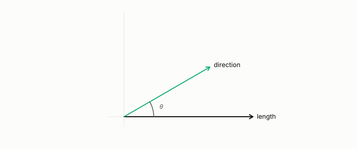

# direction-only quantizer

**id.** direction-only-quantizer
**kind.** instrument

## definition

A quantizer that stores each vector's length exactly and rounds its direction. Chapter 11.

**Example.** A vector of length 5 at 30 degrees is stored as the length 5 exactly and the direction rounded to the nearest of 16 angles.

## equation

Book equation 11.1.

    \cos\big(k,\hat k\big)=0.995\qquad\text{while}\qquad \mathrm{PPL}:\ 12.24\ \to\ 10643.

## conditions

- A quantizer that stores each vector's length exactly and rounds its direction to a unit codeword. The quantized vector keeps the original's length, its cosine with any query is the codeword's cosine, and its score against a query is the length times the query's dot product with the codeword, so the score error is the length times the query's dot product with the direction error.
- A key's cosine with its own quantized form can be near one while its score against a query moves by a multiple of its length, which is why keys at cosine 0.995 raised the perplexity by three orders of magnitude.

Conditions are curated in `entries.toml` rather than read from a record.

## ledger

- *measures.* GO-B-LOCATA `[predicted]`. Real microphone-array recordings (LOCATA), DOA consumer — held-out confirmation with the PolarQuant compressor [`geometric-observation/claims/LEDGER.md:117`](https://github.com/ahb-sjsu/geometric-observation/blob/0792c84/claims/LEDGER.md#L117).

## first stated

Chapter 11 section 11.2 of *Data Mining as Observation*, with PolarQuant in `turboquant-pro/docs/KV_KEYS_FINDING.md:1-49` and the LOCATA comparison of the ledger.

## measurements

| Where the book states it | Numbers, as the book's sources table records them | Source |
|---|---|---|
| chapter 11 section 11.2 | fp16 12.24, values-only 13.12, PolarQuant K4 10643 and 0.095, per-channel uniform K4 14.91 and 0.062, per-channel NUQ K3 15.77 and 0.148, 2.4x and 670x, pre-rotary near 22000, 2 key heads serve 12 query heads | [`turboquant-pro/docs/KV_KEYS_FINDING.md:1-49`](https://github.com/ahb-sjsu/turboquant-pro/blob/856c4cb/docs/KV_KEYS_FINDING.md#L1-L49) |

## failures and corrections

none

## machine checked

[`lean/DataMiningAsObservation/DirectionQuantizer.lean`](https://github.com/ahb-sjsu/observation-data-mining/blob/95af30c/lean/DataMiningAsObservation/DirectionQuantizer.lean), theorems `length_preserved`, `score_eq`, `score_error`, `cosine_eq`, at observation-data-mining 95af30c; what the check covers is stated in the book's [appendix C](https://github.com/ahb-sjsu/observation-data-mining/blob/95af30c/chapters/machine_checked.md).

## used in

*Data Mining as Observation* chapters 0, 3, 4, 11.

## related

quantization, dot-product, kv-cache, attention, flip

## see also

Book equations stated beside the entry's terms, not defining it: 0.1.

Ledger rows that cite the entry's records without naming it: NEG-2.

Sources-table rows that share a record with the entry without naming it: chapter 1 section 1.4, chapter 2 section 2.5, chapter 3 section 3.2, chapter 8 section 8.2, chapter 11 section 11.1.

## status

Generated 2026-09-07 by `encyclopedia/generate.py`; book at observation-data-mining 95af30c; the commit of every record is listed in the encyclopedia's provenance.
