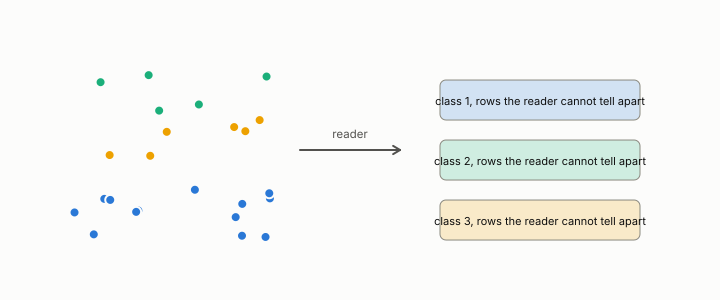

# discretization

**id.** discretization
**kind.** instrument

## definition

Collapsing an ordered quantity to a few labels by binning it, so that values in one cell become indistinguishable. It forms a quotient. Chapter 2 section 2.5.

**Example.** Ages 23, 27, and 29 all become the label 20 to 29 in ten-year bins.

## equation

none

## conditions

- Collapsing an ordered quantity to a few labels by binning it. The bin index is nondecreasing in the value, every value in a cell gets the cell's index, two values in the same cell become indistinguishable, and a sample confined to m cells has at most m distinct labels.
- A discretization forms a quotient before anyone has said who reads the result, and a consumer that read the values it merged has lost them for every stage after.

Conditions are curated in `entries.toml` rather than read from a record.

## ledger

none

## first stated

Chapter 2 section 2.5 of *Data Mining as Observation*, after TSK section 2.3.

## measurements

none

## failures and corrections

none

## invariance envelope

none declared

## machine checked

[`lean/DataMiningAsObservation/Discretization.lean`](https://github.com/ahb-sjsu/observation-data-mining/blob/95af30c/lean/DataMiningAsObservation/Discretization.lean), theorems `bin_mono`, `bin_of_mem`, `bin_eq_of_same_cell`, `card_bins_le`, at observation-data-mining 95af30c; what the check covers is stated in the book's [appendix C](https://github.com/ahb-sjsu/observation-data-mining/blob/95af30c/chapters/machine_checked.md).

## used in

*Data Mining as Observation* chapters 2.

## related

quotient, standardization, attribute-type, bit, quantization

## see also

Book equations stated beside the entry's terms, not defining it: 2.1, 0.12a.

Sources-table rows that share a record with the entry without naming it: chapter 2 section 2.1, chapter 2 section 2.3.

## status

Generated 2026-09-09 by `encyclopedia/generate.py`; book at observation-data-mining 95af30c; the commit of every record is listed in the encyclopedia's provenance.
