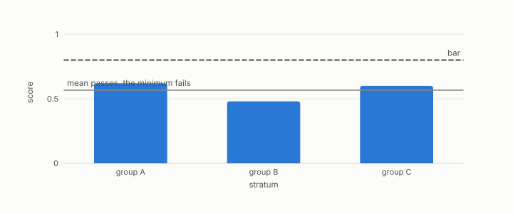

# disparate impact ratio

**id.** disparate-impact-ratio
**kind.** concept

## definition

The rate of a favourable decision in one group divided by the rate in another. Equation 0.37.

**Example.** Positive rates of 0.48 for one group and 0.60 for another give a ratio of 0.8.

## equation

Book equation 0.37.

    \mathrm{DI}=\frac{\Pr[\hat y=1\mid g=a]}{\Pr[\hat y=1\mid g=b]},\qquad \text{equalized odds}:\ \mathrm{TPR}_a=\mathrm{TPR}_b,\ \mathrm{FPR}_a=\mathrm{FPR}_b.

Book equation 14.5.

    \mathrm{FC}_g=\Pr\big[y=\text{violation}\ \big|\ \hat y=\text{clear},\ g\big],\qquad \text{verdict}=\max_{g:\ n_g\ge n_{\min}}\mathrm{FC}_g,\qquad \text{ABSTAIN otherwise}.

## conditions

- The ratio of the favourable-decision rate in one group to the rate in another. It is one exactly when the rates agree, it inverts when the groups are swapped, and the four-fifths rule is a statement about the rate gap.
- The book's verdict is per group with a null, the worst group's false-clear rate over the groups large enough to score, which clears a bar exactly when every scored group does and is never below the pooled rate.

Conditions are curated in `entries.toml` rather than read from a record.

## ledger

none

## first stated

Chapter 0 section 0.18 and chapter 14 section 14.6 of *Data Mining as Observation*, with the per-group verdict of equation 14.5.

## measurements

none

## failures and corrections

none

## invariance envelope

none declared

## machine checked

[`lean/DataMiningAsObservation/DisparateImpact.lean`](https://github.com/ahb-sjsu/observation-data-mining/blob/c149a10/lean/DataMiningAsObservation/DisparateImpact.lean), theorems `ratio_eq_one_iff`, `ratio_swap`, `four_fifths_iff`, `verdict_le_iff`, `weighted_le_verdict`, at observation-data-mining c149a10; what the check covers is stated in the book's [appendix C](https://github.com/ahb-sjsu/observation-data-mining/blob/c149a10/chapters/machine_checked.md).

## used in

*Data Mining as Observation* chapters 0, 14.

## related

equalized-odds, min-over-strata, false-clear-rate, abstention

## see also

Sources-table rows that share a record with the entry without naming it: chapter 14 section 14.1.

## status

Generated 2026-09-09 by `encyclopedia/generate.py`; book at observation-data-mining c149a10; the commit of every record is listed in the encyclopedia's provenance.
