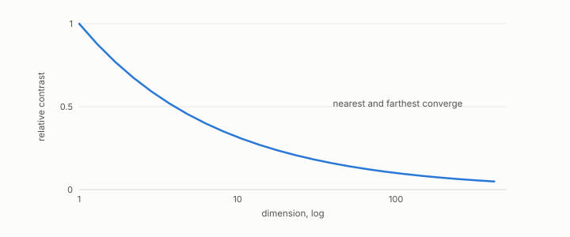

# distance concentration

**id.** distance-concentration
**kind.** concept

## definition

The narrowing of the spread of pairwise distances as dimension grows, read in the book as the reader running out of resolution. Chapter 3.

**Example.** In 500 dimensions the nearest and the farthest of 1000 random points differ in distance by a few percent.

## equation

none

## conditions

- When a squared distance is a sum of independent coordinate contributions with a common mean and variance, its relative spread is the variance over the dimension times the squared mean, which falls with the dimension and tends to zero. The independence is the model's assumption.
- The book reads the narrowing as a property of the reader, the identity reader on all coordinates, and not of the data. A consumer that reads a low-dimensional subspace does not see it, which is why the effective rank and not the ambient dimension is the number that matters.

Conditions are curated in `entries.toml` rather than read from a record.

## ledger

none

## first stated

The classical result on nearest neighbours in high dimension, as TSK chapter 2 presents it, and chapter 3 section 3.4 of *Data Mining as Observation*, where it is read as the reader running out of resolution.

## measurements

none

## failures and corrections

none

## invariance envelope

none declared

## machine checked

[`lean/DataMiningAsObservation/DistanceConcentration.lean`](https://github.com/ahb-sjsu/observation-data-mining/blob/f3914f0/lean/DataMiningAsObservation/DistanceConcentration.lean), theorems `relSpread_eq`, `relSpread_antitone`, `relSpread_tendsto_zero`, `exists_dim_relSpread_lt`, at observation-data-mining f3914f0; what the check covers is stated in the book's [appendix C](https://github.com/ahb-sjsu/observation-data-mining/blob/f3914f0/chapters/machine_checked.md).

## used in

*Data Mining as Observation* chapters 3.

## related

hubness, effective-rank, read-subspace, rank-certificate

## see also

Book equations stated beside the entry's terms, not defining it: 0.7.

Ledger rows that cite the entry's records without naming it: NEG-11.

Sources-table rows that share a record with the entry without naming it: chapter 3 section 3.5, chapter 4 section 4.2.

## status

Generated 2026-09-12 by `encyclopedia/generate.py`; book at observation-data-mining f3914f0; the commit of every record is listed in the encyclopedia's provenance.
