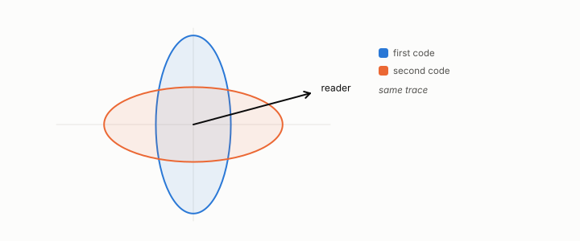

# distortion

**id.** distortion
**kind.** concept

## definition

The error a code costs a reader, the trace of the read operator against the error covariance. For the identity reader it is the reconstruction error. Chapter 4 section 4.2.

**Example.** Two codes with the same total error 2.0 cost a reader at 15 degrees 0.394 and 1.606, four to one.

## equation

Book equation 4.2.

    D(b)=\sum_i s_i\sigma_i^{2}\,2^{-2b_i},\qquad s_i=v_i^{\top}P_C\,v_i,\qquad b_i^{\star}=\max\!\Big(0,\ \tfrac12\log_2\frac{s_i\sigma_i^{2}}{\theta}\Big),\qquad \sum_i b_i^{\star}=B,

## conditions

- The error a code costs a reader, the trace of the read operator against the error covariance. For the identity reader it is the reconstruction error, and for a reader with one direction it is the error along that direction alone, so two codes with equal reconstruction error can differ four to one for a reader at fifteen degrees.
- At matched bits the downstream preservation is not controlled by reconstruction and is controlled by the consumer-projected error, twelve of twelve, and read distortion controls but is not a complete rank statistic.

Conditions are curated in `entries.toml` rather than read from a record.

## ledger

none

## first stated

Chapter 1 section 1.4 and chapter 4 section 4.2 of *Data Mining as Observation*, with the read distortion in `geometric-observation/chapters/ch05_the_read_metric_and_the_quotient.md:49`.

## measurements

| Where the book states it | Numbers, as the book's sources table records them | Source |
|---|---|---|
| chapter 2 section 2.2 | read distortion controls but is not a complete rank statistic, twelve of twelve, one middle pair misordered, NEG-9 | [`geometric-observation/chapters/ch05_the_read_metric_and_the_quotient.md:49-75`](https://github.com/ahb-sjsu/geometric-observation/blob/fc6b378/chapters/ch05_the_read_metric_and_the_quotient.md#L49-L75) |
| chapter 3 section 3.2 | traces 2.0, diagonals 0.3 and 1.7, consumers at 15 and 75 degrees, distortion 0.39 vs 1.61, 4.1 to one, computed not drawn | `observation-theory\assets\make_flip_figure.py:4-24,107-119` |

## failures and corrections

none

## invariance envelope

none declared

## machine checked

[`lean/DataMiningAsObservation/ReadDistortion.lean`](https://github.com/ahb-sjsu/observation-data-mining/blob/f3914f0/lean/DataMiningAsObservation/ReadDistortion.lean), theorems `read_distortion`, `identity_reader`, `quad_one`, at observation-data-mining f3914f0; what the check covers is stated in the book's [appendix C](https://github.com/ahb-sjsu/observation-data-mining/blob/f3914f0/chapters/machine_checked.md).

[`lean/DataMiningAsObservation/Quantization.lean`](https://github.com/ahb-sjsu/observation-data-mining/blob/f3914f0/lean/DataMiningAsObservation/Quantization.lean), theorems `error_le_half_step`, `quantize_level`, `half_step_bound`, `sq_error_le`, `finer_step`, at observation-data-mining f3914f0; what the check covers is stated in the book's [appendix C](https://github.com/ahb-sjsu/observation-data-mining/blob/f3914f0/chapters/machine_checked.md).

## used in

*Data Mining as Observation* primer L, chapters 0, 1, 2, 3, 4, 7, 8, 9, 11, 13.

## related

read-distortion, reconstruction-error, identity-reader, flip-the, quantization

## see also

Book equations stated beside the entry's terms, not defining it: 2.1, 0.11.

Ledger rows that cite the entry's records without naming it: OT-7, GO-2 (neg. half: not reconstruction), GO-6.

Sources-table rows that share a record with the entry without naming it: chapter 4 section 4.2.

## status

Generated 2026-09-10 by `encyclopedia/generate.py`; book at observation-data-mining f3914f0; the commit of every record is listed in the encyclopedia's provenance.
