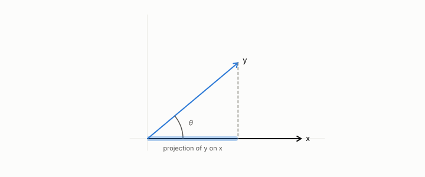

# dot product

**id.** dot-product
**kind.** concept

## definition

The sum of the coordinatewise products of two vectors. Equation 0.1.

**Example.** (1, 2) · (3, 4) = 3 + 8 = 11.

## equation

Book equation 0.1.

    x\cdot y=\sum_{i=1}^{d}x_i y_i,\qquad \|x\|=\sqrt{x\cdot x},\qquad \cos\theta=\frac{x\cdot y}{\|x\|\,\|y\|}.

Book equation 11.1.

    \cos\big(k,\hat k\big)=0.995\qquad\text{while}\qquad \mathrm{PPL}:\ 12.24\ \to\ 10643.

## conditions

- The sum of the coordinatewise products of two vectors, symmetric and bilinear. The cosine, the dot product over the two lengths, lies between minus one and one by Cauchy–Schwarz and is unchanged when either vector is scaled by a positive factor, while the dot product scales with the vector.
- A cosine reader has declared length a nuisance and a dot-product reader has not, which is the reader difference of chapter 3, and cosine 0.995 between keys and their reconstruction said nothing about the softmax that read them.

Conditions are curated in `entries.toml` rather than read from a record.

## ledger

none

## first stated

Chapter 0 section 0.1 and chapter 3 section 3.2 of *Data Mining as Observation*, with the program's cosine-versus-consumer case in `turboquant-pro/docs/KV_KEYS_FINDING.md:1-49`.

## measurements

none

## failures and corrections

none

## invariance envelope

none declared

## machine checked

[`lean/DataMiningAsObservation/DotProduct.lean`](https://github.com/ahb-sjsu/observation-data-mining/blob/c149a10/lean/DataMiningAsObservation/DotProduct.lean), theorems `self_nonneg`, `dot_comm`, `dot_sq_le`, `cosine_mem`, `dot_smul`, `cosine_smul`, at observation-data-mining c149a10; what the check covers is stated in the book's [appendix C](https://github.com/ahb-sjsu/observation-data-mining/blob/c149a10/chapters/machine_checked.md).

## used in

*Data Mining as Observation* chapters 0, 1, 2, 3, 8, 11, 12.

## related

projection, euclidean-distance, quotient, nuisance

## see also

Ledger rows that cite the entry's records without naming it: NEG-2.

Sources-table rows that share a record with the entry without naming it: chapter 1 section 1.4, chapter 2 section 2.5, chapter 3 section 3.2, chapter 8 section 8.2, chapter 11 section 11.1, chapter 11 section 11.2.

## status

Generated 2026-09-09 by `encyclopedia/generate.py`; book at observation-data-mining c149a10; the commit of every record is listed in the encyclopedia's provenance.
