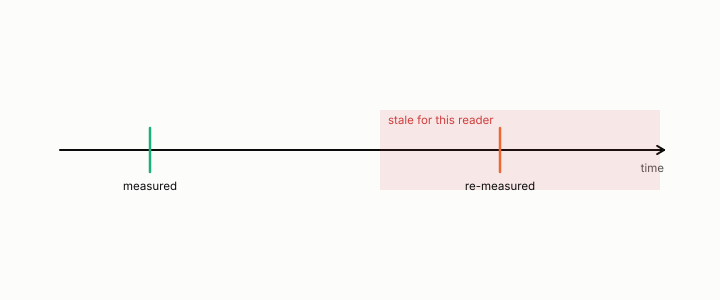

# drift

**id.** drift
**kind.** concept

## definition

A change over time in what a consumer reads or in the data it reads. Chapter 8 tests a drift claim against its null and finds half of it was noise.

**Example.** A read operator measured at rank one moved to correlation 0.667 with its earlier self, against a null of 0.933.

## equation

Book equation 13.1.

    \mathrm{FC}=\Pr\big[W\ \text{refutes}\ \big|\ \mathcal C_t\ \text{clears}\big],\qquad d_O(\Delta)=\operatorname{tr}\big(P_C\,M_{\mathrm{drift}}(\Delta)\big),\qquad M_{\mathrm{drift}}(\Delta)=\mathbb E\big[\delta_\Delta\delta_\Delta^{\top}\big].

## conditions

- A drift is a change over time in what a consumer reads or in the data it reads, and its damage is the read distortion of the drift, so it is consumer-relative. The same drift is read as its full squared size by one consumer and as nothing by another, and a drift confined to the nuisance is read as zero however large.
- The operator-drift claim was tested against a paired null and half of it was noise. The rank-one drift held in fourteen of sixteen cells on one model, and the refresh intervention derived from it was refuted, which the ledger carries.

Conditions are curated in `entries.toml` rather than read from a record.

## ledger

- *refutes or corrects.* OT-4 `[refuted]`. Operator drift predicts a real long-generation degradation and a derived refresh intervention moves it. [`geometric-observation/claims/LEDGER.md:36`](https://github.com/ahb-sjsu/geometric-observation/blob/0792c84/claims/LEDGER.md#L36).
- *refutes or corrects.* OT-11 `[void]`. Feedback-free staleness: streaming-retrieval damage tracks measured drift; derived-cadence re-allocation removes it. [`geometric-observation/claims/LEDGER.md:48`](https://github.com/ahb-sjsu/geometric-observation/blob/0792c84/claims/LEDGER.md#L48).

## first stated

Volume 14, chapter 19, `geometric-observation/chapters/ch19_the_certificate_that_ages.md`, DOI 10.5281/zenodo.21776291, and the operator-drift record in readscope, `readscope/calibration/records/c11c-operator-drift.json`.

## measurements

| Where the book states it | Numbers, as the book's sources table records them | Source |
|---|---|---|
| chapter 11 section 11.9 | drift at rank one 0.667 vs null 0.933, sixteen cells | [`readscope/CALIBRATION.md:600-660`](https://github.com/ahb-sjsu/readscope/blob/83fee4c/CALIBRATION.md#L600-L660) F-24; [`readscope/calibration/records/c11c-operator-drift.json`](https://github.com/ahb-sjsu/readscope/blob/83fee4c/calibration/records/c11c-operator-drift.json) |

## failures and corrections

- OT-4, `[refuted]`. Operator drift predicts a real long-generation degradation and a derived refresh intervention moves it. [`geometric-observation/claims/LEDGER.md:36`](https://github.com/ahb-sjsu/geometric-observation/blob/0792c84/claims/LEDGER.md#L36).
- OT-11, `[void]`. Feedback-free staleness: streaming-retrieval damage tracks measured drift; derived-cadence re-allocation removes it. [`geometric-observation/claims/LEDGER.md:48`](https://github.com/ahb-sjsu/geometric-observation/blob/0792c84/claims/LEDGER.md#L48).

## machine checked

[`lean/DataMiningAsObservation/Drift.lean`](https://github.com/ahb-sjsu/observation-data-mining/blob/95af30c/lean/DataMiningAsObservation/Drift.lean), theorems `damage_rank_one`, `same_drift_two_consumers`, `damage_eq_zero_of_nuisance`, `damage_nonneg`, at observation-data-mining 95af30c; what the check covers is stated in the book's [appendix C](https://github.com/ahb-sjsu/observation-data-mining/blob/95af30c/chapters/machine_checked.md).

## used in

*Data Mining as Observation* chapters 2, 8, 11, 13, 14.

## related

coherence-time, freshness, certificate, read-distortion

## see also

Book equations stated beside the entry's terms, not defining it: 0.10.

Sources-table rows that share a record with the entry without naming it: chapter 8 section 8.4, chapter 11 section 11.9, chapter 13 section 13.2.

## status

Generated 2026-09-07 by `encyclopedia/generate.py`; book at observation-data-mining 95af30c; the commit of every record is listed in the encyclopedia's provenance.
