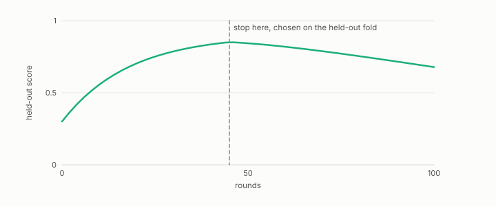

# early stopping

**id.** early-stopping
**kind.** instrument

## definition

Halting a boosting run when a held-out score stops improving. The rule reads the held-out fold, so it is a harness and the round count is a fitted parameter. Chapter 7 section 7.5.

## equation

none

## conditions

- Halting a boosting or gradient run when a held-out score stops improving. The stopping rule reads the held-out fold, so the fold it reads is no longer held out for the reported score, and a scorer that has read the test fold scores it perfectly.
- Early stopping is a harness. The round count it picks is a fitted parameter, and the report states which fold picked it and which fold scored it.

Conditions are curated in `entries.toml` rather than read from a record.

## ledger

none

## first stated

Chapter 7 section 7.5 of *Data Mining as Observation*, after ESL 10.12.

## measurements

none

## failures and corrections

none

## machine checked

`lean/DataMiningAsObservation/Leakage.lean`, theorems `errors_lookup_eq_zero`, `lookup_default`, at observation-data-mining 08b4794.

`lean/DataMiningAsObservation/CrossValidation.lean`, theorems `sizes_sum`, `accuracy_weighted`, `accuracy_mean_of_equal`, at observation-data-mining 08b4794.

## used in

*Data Mining as Observation* chapters 7.

## related

harness, leakage, cross-validation, boosting, split

## see also

Book equations stated beside the entry's terms, not defining it: 8.1, 8.2.

Ledger rows that cite the entry's records without naming it: NEG-4.

Sources-table rows that share a record with the entry without naming it: chapter 6 section 6.4, chapter 6 section 6.5, chapter 7 section 7.2.

## status

Generated 2026-09-06 by `encyclopedia/generate.py`; book at observation-data-mining 08b4794; the commit of every record is listed in the encyclopedia's provenance.
