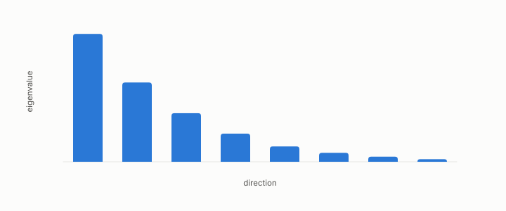

# effective rank

**id.** effective-rank
**kind.** concept

## definition

The number of directions a matrix really uses, the square of the sum of its eigenvalues over the sum of their squares, defined for a nonnegative spectrum that is not all zero, with no cutoff to choose. Equation 0.7.

**Example.** Eigenvalues (1, 1, 1, 1) have effective rank 4, and (1, 0.12, 0.06, 0.02) have effective rank about 1.4.

## equation

Book equation 0.7.

    r_{\mathrm{eff}}=\frac{\big(\sum_i\lambda_i\big)^{2}}{\sum_i\lambda_i^{2}}.

## conditions

- The effective rank is the square of the sum of the eigenvalues over the sum of their squares, between one and the dimension for a nonnegative spectrum, with no cutoff to choose.
- It is not invariant under a change of basis of the input, unlike the trace pairing and the rank, and the ledger row that says so is the one that licenses comparing read operators across coordinate systems.
- An allocation over a spectrum with effective rank below two concentrates on one direction, and the allocation report says so before giving a gain.
- It is defined for a nonnegative spectrum that is not all zero, and it lies between one and the dimension.

Conditions are curated in `entries.toml` rather than read from a record.

## ledger

- *measures.* OT-7 `[demonstrated]`. The damage form, trace pairing, rank, and loading covariance are GL(d)-invariant under `P' = A⁻ᵀPA⁻¹`, while spectrum, effective rank, principal angles, and water-filling are O(d)-only — consumer-weighted damage is a geometric scalar, and … [`geometric-observation/claims/LEDGER.md:30`](https://github.com/ahb-sjsu/geometric-observation/blob/ab4a0db/claims/LEDGER.md#L30).

## first stated

The participation ratio of a spectrum, applied to read operators in readscope, `readscope/readscope/spectrum.py:35-70`, and chapter 0 section 0.4 of *Data Mining as Observation*.

## measurements

| Where the book states it | Numbers, as the book's sources table records them | Source |
|---|---|---|
| chapter 4 section 4.2 | effective rank as participation ratio, energy rank | [`readscope/readscope/spectrum.py:35-70`](https://github.com/ahb-sjsu/readscope/blob/856e678/readscope/spectrum.py#L35-L70) |
| chapter 4 section 4.2 | allocation report, gain over uniform, concentration caution below effective rank 2 | [`turboquant-pro/turboquant_pro/read_allocation.py:244-307`](https://github.com/ahb-sjsu/turboquant-pro/blob/856c4cb/turboquant_pro/read_allocation.py#L244-L307) |
| chapter 9 section 9.4 | explained ratios, effective rank 5.19 of 8, convergence with a second method, property of the representation not the space | [`gtc-prototype/docs/SPECTRUM_FINDINGS.md:10-18`](https://github.com/ahb-sjsu/gtc-prototype/blob/c4ca1ef/docs/SPECTRUM_FINDINGS.md#L10-L18) |

## failures and corrections

none

## invariance envelope

none declared

## machine checked

[`lean/DataMiningAsObservation/EffectiveRank.lean`](https://github.com/ahb-sjsu/observation-data-mining/blob/95af30c/lean/DataMiningAsObservation/EffectiveRank.lean), theorems `sq_sum_le`, `effRank_le`, `sum_sq_le_sq_sum`, `one_le_effRank`, `effRank_const`, `effRank_single`, at observation-data-mining 95af30c; what the check covers is stated in the book's [appendix C](https://github.com/ahb-sjsu/observation-data-mining/blob/95af30c/chapters/machine_checked.md).

## used in

*Data Mining as Observation* chapters 0, 4, 9, 11, 14.

## related

read-operator, read-subspace, water-filling, recognizer

## see also

Book equations stated beside the entry's terms, not defining it: 4.2.

Sources-table rows that share a record with the entry without naming it: chapter 14 section 14.3, chapter 14 section 14.5, chapter 14 section 14.7.

## status

Generated 2026-09-09 by `encyclopedia/generate.py`; book at observation-data-mining 95af30c; the commit of every record is listed in the encyclopedia's provenance.
