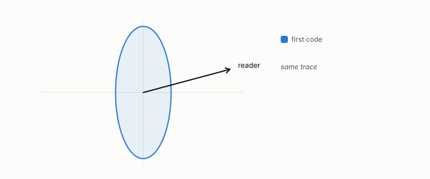

# eigenvalue, eigenvector

**id.** eigenvalue-eigenvector
**kind.** concept

## definition

A direction a symmetric matrix only stretches, and the factor by which it stretches it. The eigenvectors of a covariance are its principal directions. Equation 0.5.

**Example.** diag(0.3, 1.7) has eigenvalues 0.3 and 1.7 with eigenvectors along the two axes.

## equation

Book equation 0.5.

    \Sigma\,v_i=\lambda_i v_i,\qquad \Sigma=\sum_{i=1}^{d}\lambda_i\,v_i v_i^{\top},\qquad v_i\cdot v_j=0\ (i\ne j).

Book equation 0.7.

    r_{\mathrm{eff}}=\frac{\big(\sum_i\lambda_i\big)^{2}}{\sum_i\lambda_i^{2}}.

Book equation 9.2.

    N(\lambda)=\#\{k:\lambda_k\le\lambda\}\ \sim\ C_d\,\lambda^{d/2}\qquad\Rightarrow\qquad d=2\,\frac{d\log N}{d\log\lambda}.

## conditions

- A direction a symmetric matrix only stretches, and the factor by which it stretches it. Eigenvectors with distinct eigenvalues are orthogonal, every eigenvalue of a semidefinite matrix is nonnegative, and the quadratic form along an eigenvector is the eigenvalue times the squared length.
- The eigenvectors of a covariance are its principal directions, the basis in which chapter 4 pairs the covariance with the read operator, and the eigenvalues of a Laplacian are what the recognizer reads.

Conditions are curated in `entries.toml` rather than read from a record.

## ledger

none

## first stated

Chapter 0 section 0.4 of *Data Mining as Observation*, with the program's spectrum records in readscope and the recognizer battery.

## measurements

none

## failures and corrections

none

## invariance envelope

none declared

## machine checked

[`lean/DataMiningAsObservation/Eigen.lean`](https://github.com/ahb-sjsu/observation-data-mining/blob/f3914f0/lean/DataMiningAsObservation/Eigen.lean), theorems `pairing_symm`, `orthogonal_of_ne`, `eigenvalue_nonneg`, `quad_eigen`, at observation-data-mining f3914f0; what the check covers is stated in the book's [appendix C](https://github.com/ahb-sjsu/observation-data-mining/blob/f3914f0/chapters/machine_checked.md).

## used in

*Data Mining as Observation* primer L, chapters 0, 3, 4, 9, 11.

## related

covariance-matrix, effective-rank, whitening, recognizer, laplacian

## see also

Ledger rows that cite the entry's records without naming it: OT-7.

Sources-table rows that share a record with the entry without naming it: chapter 4 section 4.2, chapter 9 section 9.4, chapter 14 section 14.3, chapter 14 section 14.5, chapter 14 section 14.7.

## status

Generated 2026-09-10 by `encyclopedia/generate.py`; book at observation-data-mining f3914f0; the commit of every record is listed in the encyclopedia's provenance.
