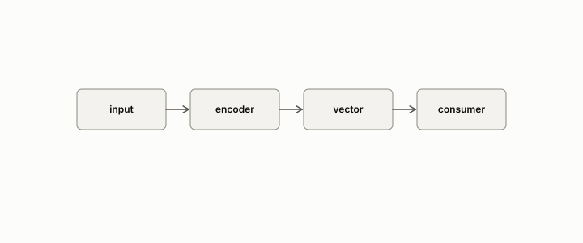

# embedding

**id.** embedding
**kind.** concept

## definition

A vector assigned to an object, a word, a sentence, a node, a document, so that nearness in the vector space stands for a relation between the objects. Chapter 11.

**Example.** A sentence becomes a vector of 768 numbers, and two paraphrases become vectors with cosine near one.

## equation

none

## conditions

- A vector assigned to an object so that nearness in the vector space stands for a relation between the objects. Objects with the same embedding are indistinguishable to every consumer of the embedding, so the embedding is a quotient, and a cosine reader takes a further quotient in which the nearest neighbour is unchanged when the query is rescaled, where a dot-product reader does not.
- What an embedding is worth to a consumer is the consumer's number. The keys that reconstructed at cosine 0.995 and raised the perplexity by three orders of magnitude are the case, and the rank certificate is the instrument that says which neighbour rankings a compressed embedding preserved.

Conditions are curated in `entries.toml` rather than read from a record.

## ledger

- *measures.* GO-B-legal (035→036) `[predicted]`. Legal-citation retrieval (CourtListener), cosine-ranking consumer, LaBSE embeddings — real large corpus, non-physical consumer [`geometric-observation/claims/LEDGER.md:119`](https://github.com/ahb-sjsu/geometric-observation/blob/aec4c97/claims/LEDGER.md#L119).

## first stated

Chapter 11 section 11.1 of *Data Mining as Observation*, with the program's embeddings in the legal-citation flip, the GloVe corpus of readscope, and the attention keys of the KV finding.

## measurements

none

## failures and corrections

none

## invariance envelope

none declared

## machine checked

[`lean/DataMiningAsObservation/Embedding.lean`](https://github.com/ahb-sjsu/observation-data-mining/blob/95af30c/lean/DataMiningAsObservation/Embedding.lean), theorems `quotient`, `cosine_scale_free`, `nearest_scale_free`, `dot_not_scale_free`, at observation-data-mining 95af30c; what the check covers is stated in the book's [appendix C](https://github.com/ahb-sjsu/observation-data-mining/blob/95af30c/chapters/machine_checked.md).

## used in

*Data Mining as Observation* chapters 0, 1, 3, 4, 8, 9, 10, 11, 12, 13, 14.

## related

encoder, dot-product, rank-certificate, hubness, flip

## see also

Book equations stated beside the entry's terms, not defining it: 11.1, 11.2.

Ledger rows that cite the entry's records without naming it: NEG-2.

Sources-table rows that share a record with the entry without naming it: chapter 1 section 1.4, chapter 2 section 2.5, chapter 3 section 3.2, chapter 4 section 4.5, chapter 8 section 8.2, chapter 11 section 11.1, chapter 11 section 11.2.

## status

Generated 2026-09-09 by `encyclopedia/generate.py`; book at observation-data-mining 95af30c; the commit of every record is listed in the encyclopedia's provenance.
