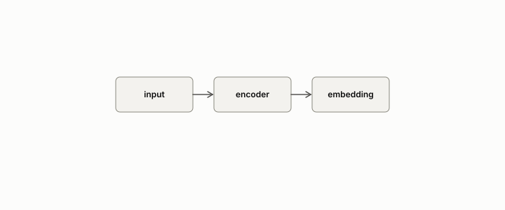

# encoder

**id.** encoder
**kind.** concept

## definition

A model that maps an input to an embedding. Chapter 12.

**Example.** LaBSE maps a sentence in any of its languages to a 768-dimensional vector.

## equation

Book equation 12.3.

    \text{validated}\iff \mathrm{AUROC}_{\text{cross}}-\max\big(\mathrm{AUROC}_{\text{untrained}},\ \mathrm{AUROC}_{\text{BoW}}\big)\ \ge\ 0.10.

Book equation 14.1.

    S=\frac{\sum_i w_i\,s_i}{\sum_i w_i},\qquad w_i=\max\big(0,\ 2\cdot\mathrm{AUROC}_i-1\big).

## conditions

- A model that maps an input to an embedding. An encoder votes only when its held-out AUROC on a corpus it was not trained on clears both nulls by the preregistered margin, its authority is its reliability weight, and a strictly monotone recalibration of its score changes neither the verdict nor the weight.
- The rights encoder fell below the untrained baseline and was retired rather than tuned, and the legal-citation encoder's flip is the ledger's demonstrated row.
- An encoder's held-out AUROC depends on the orientation of its score. A score that ranks the wrong way scores 1 minus A, and the gate reads the score as the encoder produces it and not the better of the two orientations.

Conditions are curated in `entries.toml` rather than read from a record.

## ledger

none

## first stated

Chapter 12 section 12.5 of *Data Mining as Observation*, with the program's encoders in xbse and the calibrated authority of `gtc-prototype/docs/CALIBRATED_AUTHORITY.md:19-63`.

## measurements

| Where the book states it | Numbers, as the book's sources table records them | Source |
|---|---|---|
| chapter 8 section 8.6 | rights encoder 0.467 below untrained baseline, the AUROC lesson, cross-corpus same-sign fix | `xbse/README.md:160-172`; `xbse/experiments/rights_r6_summary.json` |

## failures and corrections

none

## machine checked

[`lean/DataMiningAsObservation/CrossCorpusGate.lean`](https://github.com/ahb-sjsu/observation-data-mining/blob/95af30c/lean/DataMiningAsObservation/CrossCorpusGate.lean), theorems `clears_bow`, `clears_untrained`, `not_validated_of_saturated`, `margin_example`, `validated_comp`, at observation-data-mining 95af30c; what the check covers is stated in the book's [appendix C](https://github.com/ahb-sjsu/observation-data-mining/blob/95af30c/chapters/machine_checked.md).

## used in

*Data Mining as Observation* chapters 0, 7, 8, 9, 10, 11, 12, 14.

## related

embedding, cross-corpus-gate, reliability-weight, retrieval-augmented-pipeline

## see also

Ledger rows that cite the entry's records without naming it: GO-B-legal (035→036).

Sources-table rows that share a record with the entry without naming it: chapter 12 section 12.5, chapter 14 section 14.1, chapter 14 section 14.2.

## status

Generated 2026-09-07 by `encyclopedia/generate.py`; book at observation-data-mining 95af30c; the commit of every record is listed in the encyclopedia's provenance.
