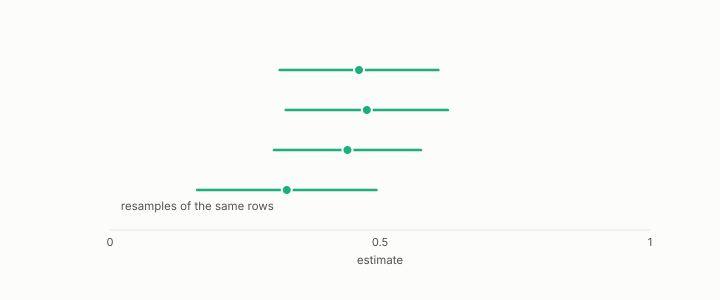

# ensemble

**id.** ensemble
**kind.** instrument

## definition

A scorer that averages or votes several scorers. Its average lies between its members and its squared error is at most their mean squared error. Chapter 7.

**Example.** Scores 0.6, 0.7, and 0.8 average 0.7, and the average's squared error is at most the mean of the three squared errors.

## equation

none

## conditions

- A scorer that averages or votes several scorers. Its average lies between the smallest and the largest member, its squared error is at most the mean of the members' squared errors, and a constant ensemble is its constant. That arithmetic is why bagging reduces variance.
- Whether an ensemble beats a formula is a measured question and not a principle, and the comparison is fair only inside one fold protocol with the Nadeau and Bengio correction applied, where nine wins to three became three wins, seventeen ties, and eleven losses.

Conditions are curated in `entries.toml` rather than read from a record.

## ledger

none

## first stated

Breiman, bagging predictors, 1996, as chapter 7 section 7.1 of *Data Mining as Observation* reads it, with the fair comparison in `constraint-gap/review/INDETERMINATES.md:1-40`.

## measurements

| Where the book states it | Numbers, as the book's sources table records them | Source |
|---|---|---|
| chapter 7 section 7.1 | bagging variance, out-of-bag estimation, random forests, importances, AdaBoost | Hastie, Tibshirani, Friedman, ESL 2e chapters 15 and 10.1; TSK 2e 4.10 |

## failures and corrections

none

## invariance envelope

none declared

## machine checked

[`lean/DataMiningAsObservation/Ensemble.lean`](https://github.com/ahb-sjsu/observation-data-mining/blob/f3914f0/lean/DataMiningAsObservation/Ensemble.lean), theorems `average_between`, `sq_average_le`, `average_const`, at observation-data-mining f3914f0; what the check covers is stated in the book's [appendix C](https://github.com/ahb-sjsu/observation-data-mining/blob/f3914f0/chapters/machine_checked.md).

## used in

*Data Mining as Observation* chapters 0, 6, 7.

## related

boosting, decision-tree, formula-classifier, standard-error, nadeau-and-bengio-correction

## see also

Book equations stated beside the entry's terms, not defining it: 6.1, 0.18, 8.2.

Sources-table rows that share a record with the entry without naming it: chapter 6 section 6.3, chapter 7 section 7.3, chapter 7 section 7.4.

## status

Generated 2026-09-12 by `encyclopedia/generate.py`; book at observation-data-mining f3914f0; the commit of every record is listed in the encyclopedia's provenance.
