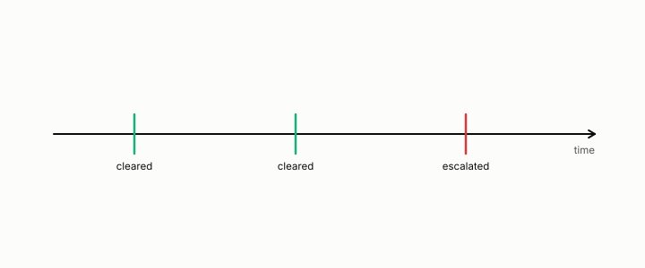

# escalation

**id.** escalation
**kind.** concept

## definition

The decision to hand an item to a person rather than decide it, the single-decision form of abstention. Chapter 14.

**Example.** A decision the certificate cannot clear at its bar is handed to a person, and the count of escalations is reported.

## equation

none

## conditions

- The decision to hand an item to a person rather than decide it. A rule that escalates every item whose margin is below a bar decides a set that can only shrink as the bar rises, so coverage can only fall, every decided item carries at least the bar's margin, and a bar of zero escalates nothing.
- Coverage times the decided false-clear rate is the fraction of all items cleared and wrong, so an escalation policy trades coverage for a false-clear rate and a deployment report states both.

Conditions are curated in `entries.toml` rather than read from a record.

## ledger

none

## first stated

Chapter 14 section 14.9 of *Data Mining as Observation*, the single-decision form of abstention, with the refusal counts of the re-description test.

## measurements

none

## failures and corrections

none

## invariance envelope

none declared

## machine checked

[`lean/DataMiningAsObservation/Escalation.lean`](https://github.com/ahb-sjsu/observation-data-mining/blob/6aebdf3/lean/DataMiningAsObservation/Escalation.lean), theorems `decided_anti`, `coverage_anti`, `decided_margin`, `decided_zero`, `joint_rate`, at observation-data-mining 6aebdf3; what the check covers is stated in the book's [appendix C](https://github.com/ahb-sjsu/observation-data-mining/blob/6aebdf3/chapters/machine_checked.md).

## used in

*Data Mining as Observation* chapters 0, 2, 8, 9, 10, 11, 14.

## related

abstention, margin, coverage, false-clear-rate, certificate

## see also

Book equations stated beside the entry's terms, not defining it: 14.5, 10.7, 0.26.

## status

Generated 2026-09-09 by `encyclopedia/generate.py`; book at observation-data-mining 6aebdf3; the commit of every record is listed in the encyclopedia's provenance.
