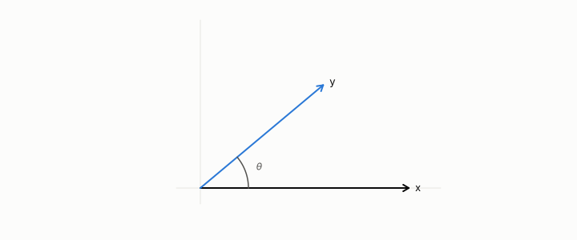

# Euclidean distance

**id.** euclidean-distance
**kind.** concept

## definition

The straight-line distance between two vectors, which reads every coordinate at the scale it arrives in. Chapter 3.

**Example.** The distance between (0, 0) and (3, 4) is 5.

## equation

none

## conditions

- The straight-line distance between two vectors, whose square is the identity reader's quadratic form on the difference, so it reads every coordinate at the scale it arrives in. It is symmetric and zero exactly between a row and itself.
- Rescaling one coordinate changes which of two rows is nearer. A choice of scale is a choice of reader, and reconstruction error, the Euclidean distance between a row and its code, is the identity reader's number and not the consumer's.

Conditions are curated in `entries.toml` rather than read from a record.

## ledger

none

## first stated

Chapter 3 section 3.2 of *Data Mining as Observation*, where a distance is a choice of what to ignore.

## measurements

none

## failures and corrections

none

## invariance envelope

none declared

## machine checked

[`lean/DataMiningAsObservation/EuclideanDistance.lean`](https://github.com/ahb-sjsu/observation-data-mining/blob/a0db6a8/lean/DataMiningAsObservation/EuclideanDistance.lean), theorems `distSq_eq_quad_one`, `distSq_comm`, `distSq_eq_zero_iff`, `ranking_flips`, at observation-data-mining a0db6a8; what the check covers is stated in the book's [appendix C](https://github.com/ahb-sjsu/observation-data-mining/blob/a0db6a8/chapters/machine_checked.md).

## used in

*Data Mining as Observation* primer L, chapters 0, 1, 2, 3, 6, 10, 11, 12.

## related

identity-reader, dot-product, mahalanobis-distance, distance-concentration

## see also

Book equations stated beside the entry's terms, not defining it: 0.1, 4.1.

Ledger rows that cite the entry's records without naming it: NEG-2.

Sources-table rows that share a record with the entry without naming it: chapter 1 section 1.4, chapter 2 section 2.5, chapter 3 section 3.2, chapter 8 section 8.2, chapter 11 section 11.1, chapter 11 section 11.2.

## status

Generated 2026-09-09 by `encyclopedia/generate.py`; book at observation-data-mining a0db6a8; the commit of every record is listed in the encyclopedia's provenance.
