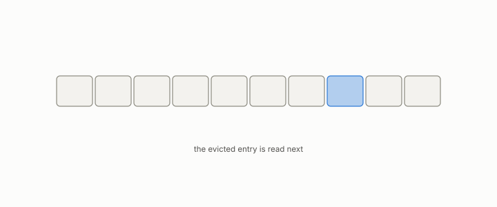

# eviction

**id.** eviction
**kind.** concept

## definition

Choosing what to drop when a cache is full. Chapter 13.

**Example.** A cache of 4 entries receiving a fifth drops the least recently used one.

## equation

none

## conditions

- Choosing what to drop when a cache is full. Evicting tokens replaces attention over all tokens with attention over the kept subset, so the output lies between the kept values, equals them when they agree, and the whole cache is the case of no eviction.
- Which tokens can go is consumer-relative, since a head reads a key only through its score, and the serving-stack measurement of ninety-seven percent eviction at a five percent keep against an oracle is the ledger's number, after one attempt whose control did not exist.

Conditions are curated in `entries.toml` rather than read from a record.

## ledger

- *measures.* GO-2/GO-12/GO-13 operational (KV serving, 077) `[demonstrated]`. Consumer-relative access width measured on a production serving stack (Qwen2.5-7B KV-cache eviction, matched budget): task quality tracks measured predictive uncertainty u about the consumer's future reads, not nominal scorer width — the … [`geometric-observation/claims/LEDGER.md:81`](https://github.com/ahb-sjsu/geometric-observation/blob/787a933/claims/LEDGER.md#L81).

## first stated

Chapter 13 section 13.6 of *Data Mining as Observation*, with the program's serving-stack case in `geometric-observation/prereg/GO-P-2026-077-kv-consumer-relative-eviction.md` and the ledger row that carries it.

## measurements

| Where the book states it | Numbers, as the book's sources table records them | Source |
|---|---|---|
| chapter 13 section 13.6 | attempt three, windows 1024, 256, 32, uncertainty 0.982 to 0.892, 5 of 6, 0.4375 with SE 0.070 at 5 percent keep vs 0.30, 97 percent eviction, oracle-miss 0.370 vs 0.25, V4 0.078 vs 0.0625, contrast 0.359 with SE 0.068, n 64, seed 20260812, 89 duty cycles | [`geometric-observation/claims/LEDGER.md`](https://github.com/ahb-sjsu/geometric-observation/blob/787a933/claims/LEDGER.md) row GO-2/GO-12/GO-13 operational; [`geometric-observation/prereg/GO-P-2026-077-kv-consumer-relative.md`](https://github.com/ahb-sjsu/geometric-observation/blob/787a933/prereg/GO-P-2026-077-kv-consumer-relative.md); [`geometric-observation/results/GO13-kvaw2-governed.json`](https://github.com/ahb-sjsu/geometric-observation/blob/787a933/results/GO13-kvaw2-governed.json) |

## failures and corrections

none

## machine checked

[`lean/DataMiningAsObservation/Eviction.lean`](https://github.com/ahb-sjsu/observation-data-mining/blob/95af30c/lean/DataMiningAsObservation/Eviction.lean), theorems `kept_weights_sum`, `keptOutput_le_max`, `min_le_keptOutput`, `keptOutput_const`, `keptOutput_univ`, at observation-data-mining 95af30c; what the check covers is stated in the book's [appendix C](https://github.com/ahb-sjsu/observation-data-mining/blob/95af30c/chapters/machine_checked.md).

## used in

*Data Mining as Observation* chapters 13.

## related

kv-cache, attention, coherence-time, budget

## see also

Book equations stated beside the entry's terms, not defining it: 13.1, 0.23.

Ledger rows that cite the entry's records without naming it: GO-12.

Sources-table rows that share a record with the entry without naming it: chapter 13 section 13.6.

## status

Generated 2026-09-07 by `encyclopedia/generate.py`; book at observation-data-mining 95af30c; the commit of every record is listed in the encyclopedia's provenance.
