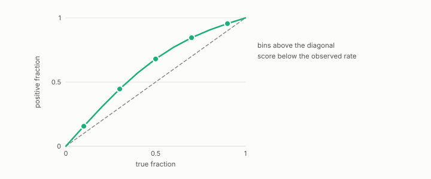

# expected calibration error

**id.** expected-calibration-error
**kind.** instrument

## definition

The average over score bins of the absolute difference between the mean score and the fraction of positives in the bin. Equation 0.29.

**Example.** Bins with mean scores 0.2 and 0.8 and positive fractions 0.3 and 0.7, each holding half the rows, give an error of 0.1.

## equation

Book equation 0.29.

    \mathrm{ECE}=\sum_b\frac{n_b}{n}\,\big|\bar s_b-\bar y_b\big|.

Book equation 0.38.

    w=\max\big(0,\ 2\cdot\mathrm{AUROC}-1\big).

## conditions

- The average over score bins, weighted by bin size, of the absolute difference between the bin's mean score and its fraction of positives. It lies in the unit interval, it is zero exactly when every bin's mean score equals its positive fraction, and a calibrated scorer has error zero.
- The program's validated encoders carry errors of 0.018 to 0.101 on held-out splits against raw values up to 0.223, and the reliability weight that gates an encoder's authority is computed beside it.

Conditions are curated in `entries.toml` rather than read from a record.

## ledger

none

## first stated

Chapter 0 section 0.14 of *Data Mining as Observation*, equation 0.29, with the program's per-encoder errors in `xbse/README.md:175-195` and `gtc-prototype/docs/CALIBRATED_AUTHORITY.md:19-63`.

## measurements

| Where the book states it | Numbers, as the book's sources table records them | Source |
|---|---|---|
| chapter 12 section 12.5 | ECE 0.018 to 0.101 vs raw up to 0.223, reliability weight, audit binding | `xbse/README.md:175-195`; [`gtc-prototype/docs/CALIBRATED_AUTHORITY.md:19-63`](https://github.com/ahb-sjsu/gtc-prototype/blob/328741f/docs/CALIBRATED_AUTHORITY.md#L19-L63) |

## failures and corrections

none

## machine checked

[`lean/DataMiningAsObservation/Calibration.lean`](https://github.com/ahb-sjsu/observation-data-mining/blob/08b4794/lean/DataMiningAsObservation/Calibration.lean), theorems `ece_nonneg`, `ece_le_one`, `ece_eq_zero_iff`, `ece_of_calibrated`, at observation-data-mining 08b4794; what the check covers is stated in the book's [appendix C](https://github.com/ahb-sjsu/observation-data-mining/blob/08b4794/chapters/machine_checked.md).

## used in

*Data Mining as Observation* chapters 0, 1, 2, 3, 4, 5, 6, 7, 8, 9, 10, 11, 12, 13, 14.

## related

calibration, reliability-weight, auroc, threshold

## see also

Book equations stated beside the entry's terms, not defining it: 14.2.

Ledger rows that cite the entry's records without naming it: NEG-4.

Sources-table rows that share a record with the entry without naming it: chapter 14 section 14.2.

## status

Generated 2026-09-06 by `encyclopedia/generate.py`; book at observation-data-mining 08b4794; the commit of every record is listed in the encyclopedia's provenance.
