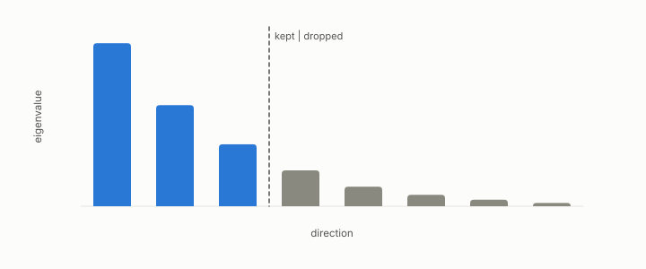

# explained variance

**id.** explained-variance
**kind.** concept

## definition

The fraction of total variance retained by a set of principal components, the identity reader's criterion for a reduction. Chapter 4.

**Example.** Keeping 2 of the eigenvalues 4, 3, 2, and 1 explains 7 of 10, or 70 percent.

## equation

Book equation 4.1.

    d_O=\operatorname{tr}(P_C\,M_\delta)\qquad\text{against}\qquad \operatorname{tr}M_\delta=d_O\big|_{P_C=I}.

## conditions

- The fraction of total variance the first k components carry. It lies in the unit interval, cannot fall as k grows, and reaches one at the full dimension. With unit sensitivities it is the fraction a consumer retains, which is why it is the identity reader's criterion.
- A consumer that reads other directions retains a different fraction. With variances 9 and 1 and a consumer reading only the second direction, keeping the first component explains nine tenths of the variance and none of what the consumer reads, which is the flip in its smallest form.

Conditions are curated in `entries.toml` rather than read from a record.

## ledger

none

## first stated

TSK appendix B on principal component analysis, as chapter 4 section 4.1 of *Data Mining as Observation* reads it, the identity reader's criterion for a reduction, with the program's spectrum record in `gtc-prototype/docs/SPECTRUM_FINDINGS.md:10-18`.

## measurements

| Where the book states it | Numbers, as the book's sources table records them | Source |
|---|---|---|
| chapter 9 section 9.4 | explained ratios, effective rank 5.19 of 8, convergence with a second method, property of the representation not the space | [`gtc-prototype/docs/SPECTRUM_FINDINGS.md:10-18`](https://github.com/ahb-sjsu/gtc-prototype/blob/c13fb96/docs/SPECTRUM_FINDINGS.md#L10-L18) |

## failures and corrections

none

## invariance envelope

none declared

## machine checked

[`lean/DataMiningAsObservation/ExplainedVariance.lean`](https://github.com/ahb-sjsu/observation-data-mining/blob/f3914f0/lean/DataMiningAsObservation/ExplainedVariance.lean), theorems `explained_mem_unit`, `explained_mono`, `explained_full`, `retained_identity`, `retained_example`, at observation-data-mining f3914f0; what the check covers is stated in the book's [appendix C](https://github.com/ahb-sjsu/observation-data-mining/blob/f3914f0/chapters/machine_checked.md).

## used in

*Data Mining as Observation* chapters 4, 8.

## related

identity-reader, flip, effective-rank, water-filling

## see also

Book equations stated beside the entry's terms, not defining it: 0.7.

Ledger rows that cite the entry's records without naming it: GO-1.

Sources-table rows that share a record with the entry without naming it: chapter 6 section 6.2, chapter 11 section 11.7, chapter 14 section 14.3, chapter 14 section 14.5, chapter 14 section 14.7.

## status

Generated 2026-09-10 by `encyclopedia/generate.py`; book at observation-data-mining f3914f0; the commit of every record is listed in the encyclopedia's provenance.
