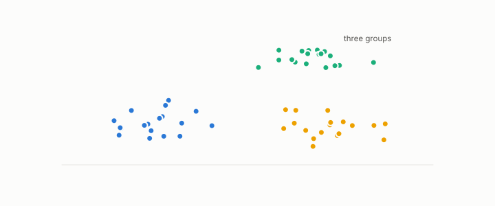

# fine-tuning

**id.** fine-tuning
**kind.** instrument

## definition

Continuing to train an encoder on a new objective or corpus, so that its quotient changes. Chapter 11 section 11.8 and chapter 12 section 12.4.

**Example.** An encoder tuned on translation pairs put seven of thirteen backbone areas in one class that the general encoder kept apart.

## equation

none

## conditions

- Continuing to train an encoder on a new objective or corpus, so that its quotient changes. A contrastive objective pulls declared pairs together, and the cross-corpus gate asks whether the tuned encoder still separates on a corpus it never saw.
- An encoder fine-tuned on one relation is evaluated on that relation and on one it never saw, with a paired interval on each, and the within-corpus score of 0.75 to 0.955 collapsed to 0.47 to 0.55 across corpora until cross-corpus positives were added.

Conditions are curated in `entries.toml` rather than read from a record.

## ledger

none

## first stated

Chapter 11 section 11.8 and chapter 12 section 12.4 of *Data Mining as Observation*, with the translation-trained encoder in `turboquant-pro/docs/RESULTS_multilingual_strata.md:55-90`.

## measurements

none

## failures and corrections

none

## invariance envelope

none declared

## machine checked

[`lean/DataMiningAsObservation/Contrastive.lean`](https://github.com/ahb-sjsu/observation-data-mining/blob/f3914f0/lean/DataMiningAsObservation/Contrastive.lean), theorems `loss_nonneg`, `loss_eq_zero_iff`, `not_both`, `loss_mono_margin`, at observation-data-mining f3914f0; what the check covers is stated in the book's [appendix C](https://github.com/ahb-sjsu/observation-data-mining/blob/f3914f0/chapters/machine_checked.md).

[`lean/DataMiningAsObservation/CrossCorpusGate.lean`](https://github.com/ahb-sjsu/observation-data-mining/blob/f3914f0/lean/DataMiningAsObservation/CrossCorpusGate.lean), theorems `clears_bow`, `clears_untrained`, `not_validated_of_saturated`, `margin_example`, `validated_comp`, at observation-data-mining f3914f0; what the check covers is stated in the book's [appendix C](https://github.com/ahb-sjsu/observation-data-mining/blob/f3914f0/chapters/machine_checked.md).

## used in

*Data Mining as Observation* chapters 11, 12.

## related

contrastive-objective, encoder, cross-corpus-gate, leakage, paraphrase-class

## see also

Book equations stated beside the entry's terms, not defining it: 12.3, 11.1.

Ledger rows that cite the entry's records without naming it: GO-B-Llama, GO-B-Llama-rematch, GO-B-legal (035→036).

Sources-table rows that share a record with the entry without naming it: chapter 10 section 10.4, chapter 11 section 11.8, chapter 12 section 12.4, chapter 12 section 12.5.

## status

Generated 2026-09-10 by `encyclopedia/generate.py`; book at observation-data-mining f3914f0; the commit of every record is listed in the encyclopedia's provenance.
