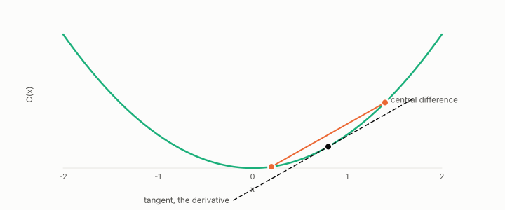

# finite difference

**id.** finite-difference
**kind.** instrument

## definition

An estimate of a derivative from two evaluations of the function at points a small step apart. Equation 0.8.

**Example.** For C(x) equal to x squared, evaluating at 0.8 plus and minus 0.6 gives (1.96 − 0.04) over 1.2, exactly 1.6.

## equation

Book equation 0.8.

    g_j\;\approx\;\frac{C(x+h\,e_j)-C(x-h\,e_j)}{2h},\qquad j=1,\dots,d.

## conditions

- An estimate of a derivative from two evaluations of the function at points a small step apart. The central difference recovers the derivative of a quadratic exactly at every step size, while the one-sided difference is off by the curvature times the step, which is why doing it in both directions is more accurate.
- Doing it once per coordinate costs d evaluations and in both directions costs 2d, which chapter 11 shows is the price at one operating point for a probe confined to the directions it chooses. The measurement instrument for that is the blind probe.

Conditions are curated in `entries.toml` rather than read from a record.

## ledger

none

## first stated

Chapter 0 section 0.5 of *Data Mining as Observation*, equation 0.8, with the budget law measured in `readscope/README.md:118-141` and `readscope/CALIBRATION.md:419-434`.

## measurements

none

## failures and corrections

none

## invariance envelope

none declared

## machine checked

[`lean/DataMiningAsObservation/FiniteDifference.lean`](https://github.com/ahb-sjsu/observation-data-mining/blob/c149a10/lean/DataMiningAsObservation/FiniteDifference.lean), theorems `central_quad`, `forward_quad`, `forward_error`, `central_cost`, at observation-data-mining c149a10; what the check covers is stated in the book's [appendix C](https://github.com/ahb-sjsu/observation-data-mining/blob/c149a10/chapters/machine_checked.md).

## used in

*Data Mining as Observation* chapters 0, 1, 2, 4, 6, 7, 11, 12, 14.

## related

sensitivity, read-operator, blind-probe, budget, budget-cliff

## see also

Book equations stated beside the entry's terms, not defining it: 0.9, 11.4.

Ledger rows that cite the entry's records without naming it: GO-1.

Sources-table rows that share a record with the entry without naming it: chapter 11 section 11.7.

## status

Generated 2026-09-09 by `encyclopedia/generate.py`; book at observation-data-mining c149a10; the commit of every record is listed in the encyclopedia's provenance.
