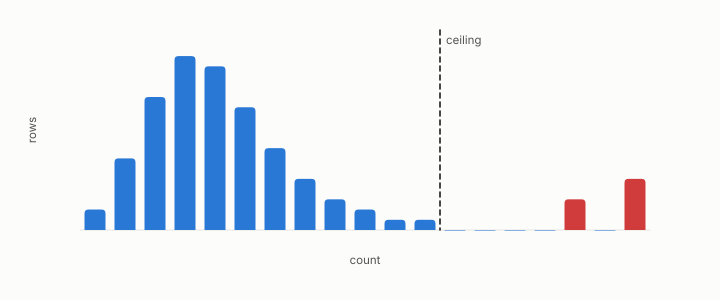

# floor, ceiling

**id.** floor-ceiling
**kind.** concept

## definition

A floor is a lower bound a quantity cannot fall below and a ceiling an upper bound it cannot exceed, each proved or measured and named as such. Chapter 0 section 0.9 and chapter 13.

**Example.** The refresh floor was 4 slots at 10 hertz, and the Poisson ceiling at 10 expected retrievals per row is about 20.

## equation

Book equation 0.17.

    \Pr[X\ge c]=1-\sum_{i<c}e^{-\mu}\frac{\mu^{i}}{i!},\qquad c^{\star}=\max\{c:\ n\Pr[X\ge c]\ge 1\},\qquad \mu=\frac{n_q\,k}{n}.

Book equation 5.4.

    \begin{gathered} F_1^{\max}\ \le\ \sup_{t\in[J,\,1]}\ \frac{2t\pi}{t\pi+\pi+(t-J)(1-\pi)},\qquad J=\max_{\tau}\big(\mathrm{TPR}-\mathrm{FPR}\big),\qquad \pi=\text{prevalence}, \\ J\le 2A-1\ \text{when the ROC curve is concave, and not in general.} \end{gathered}

Book equation 13.2.

    \begin{gathered} T_{\mathrm{coh}}=\frac{0.423}{f_D}, \\ \text{refuted fit:}\ \ \phi\approx0.177\,T_{\mathrm{coh}}\ (R^{2}=0.915), \qquad \text{sealed:}\ \ \phi\le 6\ \text{TTI at }10\ \text{Hz},\ \ 1\ \text{TTI at}\ \ge50\ \text{Hz}. \end{gathered}

## conditions

- A floor is a lower bound a quantity cannot fall below, and a ceiling an upper bound it cannot exceed, each proved or measured and named as such. The refresh floor is the shortest renewal that keeps a certificate within its error, the Poisson ceiling is the count chance allows, and the Youden ceiling bounds the best F1.
- A floor that was fitted as a fraction of the coherence time was refuted, and the omission floor that was first read as unbounded was corrected to a floor, so each is a measured object with a record.

Conditions are curated in `entries.toml` rather than read from a record.

## ledger

- *refutes or corrects.* NEG-13 → resolved `[missed]`. (GO-P-2026-026, prospective, real LLM) Appendix-E's omission floor is a rate-irreducible downstream wall on trained Llama read operators. [`geometric-observation/claims/LEDGER.md:106`](https://github.com/ahb-sjsu/geometric-observation/blob/d1f8988/claims/LEDGER.md#L106).

## first stated

Chapter 0 section 0.9 and chapter 13 section 13.4 of *Data Mining as Observation*, with the omission floor in `geometric-observation/chapters/ch07_cost.md` and the Youden ceiling in `theory-radar/paper/astar_paper.tex:94-110`.

## measurements

| Where the book states it | Numbers, as the book's sources table records them | Source |
|---|---|---|
| chapter 4 section 4.2 | commission tax of order half r log M over m, omission floor, unbounded corrected to floor, naive projector 30 percent over, VI-6 | [`geometric-observation/chapters/ch07_cost.md`](https://github.com/ahb-sjsu/geometric-observation/blob/d1f8988/chapters/ch07_cost.md) section on mismatch; [`geometric-observation/claims/LEDGER.md`](https://github.com/ahb-sjsu/geometric-observation/blob/d1f8988/claims/LEDGER.md) VI-6 |
| chapter 4 section 4.2 | floor measured on 16 of 16 heads, naive assumption off 20 to 60 percent, about 100000 times, 0.10 nats against about 6e-7, first gate missed 0 of 16, NEG-13 | [`geometric-observation/chapters/ch07_cost.md`](https://github.com/ahb-sjsu/geometric-observation/blob/d1f8988/chapters/ch07_cost.md); [`geometric-observation/claims/LEDGER.md`](https://github.com/ahb-sjsu/geometric-observation/blob/d1f8988/claims/LEDGER.md) GO-P-2026-027 and NEG-13 |

## failures and corrections

- NEG-13 → resolved, `[missed]`. (GO-P-2026-026, prospective, real LLM) Appendix-E's omission floor is a rate-irreducible downstream wall on trained Llama read operators. [`geometric-observation/claims/LEDGER.md:106`](https://github.com/ahb-sjsu/geometric-observation/blob/d1f8988/claims/LEDGER.md#L106).

## machine checked

[`lean/DataMiningAsObservation/CoherenceTime.lean`](https://github.com/ahb-sjsu/observation-data-mining/blob/08b4794/lean/DataMiningAsObservation/CoherenceTime.lean), theorems `clarke_to_three_decimals`, `examples`, `refuted_law_exceeds_sealed`, at observation-data-mining 08b4794; what the check covers is stated in the book's [appendix C](https://github.com/ahb-sjsu/observation-data-mining/blob/08b4794/chapters/machine_checked.md).

[`lean/DataMiningAsObservation/PoissonCeiling.lean`](https://github.com/ahb-sjsu/observation-data-mining/blob/08b4794/lean/DataMiningAsObservation/PoissonCeiling.lean), theorems `mass_nonneg`, `tail_antitone`, `tail_zero`, `tail_le_one`, `expectedAtLeast_antitone`, `example_mean`, at observation-data-mining 08b4794; what the check covers is stated in the book's [appendix C](https://github.com/ahb-sjsu/observation-data-mining/blob/08b4794/chapters/machine_checked.md).

[`lean/DataMiningAsObservation/YoudenF1.lean`](https://github.com/ahb-sjsu/observation-data-mining/blob/08b4794/lean/DataMiningAsObservation/YoudenF1.lean), theorems `f1_eq`, `f1_le_of_youden`, `auroc_eq`, `youden_eq`, `youden_exceeds_auroc_form`, at observation-data-mining 08b4794; what the check covers is stated in the book's [appendix C](https://github.com/ahb-sjsu/observation-data-mining/blob/08b4794/chapters/machine_checked.md).

## used in

*Data Mining as Observation* chapters 0, 3, 4, 5, 6, 7, 8, 9, 10, 11, 13, 14.

## related

refresh-floor, poisson-ceiling, youden-index, budget-cliff, bar

## see also

Ledger rows that cite the entry's records without naming it: OT-4.

Sources-table rows that share a record with the entry without naming it: chapter 4 section 4.2, chapter 6 section 6.3, chapter 13 section 13.3, chapter 13 section 13.4.

## status

Generated 2026-09-06 by `encyclopedia/generate.py`; book at observation-data-mining 08b4794; the commit of every record is listed in the encyclopedia's provenance.
