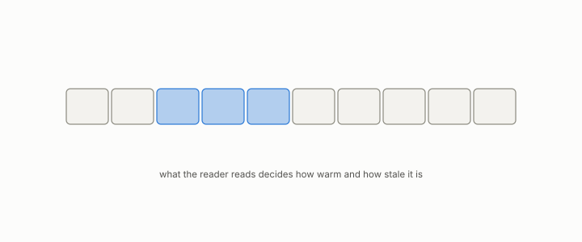

# footprint

**id.** footprint
**kind.** concept

## definition

The set of entries a reader reads. What the reader reads decides how warm and how stale the reader is. Chapter 13 section 13.3.

## equation

none

## conditions

- The set of entries a reader reads. The hit rate is one when the cache holds the footprint and does not move when entries outside it are added, so what the reader reads decides how warm, and how stale, the reader is.
- A replica is stale because of what the reader asks for. The hot reader read a false-clear rate of 0.99 and the cold reader 0.01 on the same store, and the aggregate described neither.

Conditions are curated in `entries.toml` rather than read from a record.

## ledger

none

## first stated

Chapter 13 section 13.3 of *Data Mining as Observation*, with the reader's footprint in `geometric-observation/chapters/ch19_the_certificate_that_ages.md:1-95`.

## measurements

none

## failures and corrections

none

## machine checked

`lean/DataMiningAsObservation/Cache.lean`, theorems `hitRate_mem_unit`, `hitRate_cold`, `hitRate_warm`, `hitRate_mono`, `hitRate_footprint`, at observation-data-mining 08b4794.

## used in

*Data Mining as Observation* chapters 0, 2, 11, 12, 13, 14.

## related

cache, cold-warm, replica, false-clear-rate, read-subspace

## see also

Book equations stated beside the entry's terms, not defining it: 0.26, 13.2, 13.1.

Ledger rows that cite the entry's records without naming it: OT-11, GO-12.

Sources-table rows that share a record with the entry without naming it: chapter 13 section 13.2, chapter 13 section 13.3.

## status

Generated 2026-09-06 by `encyclopedia/generate.py`; book at observation-data-mining 08b4794; the commit of every record is listed in the encyclopedia's provenance.
