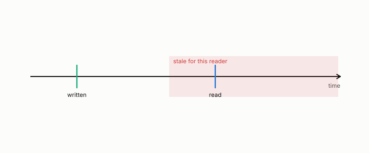

# freshness

**id.** freshness
**kind.** concept

## definition

Whether a stored value is still within its coherence time when it is read. Consumer-relative, since two readers of the same replica can have different freshness. Chapter 13.

**Example.** A value written at 10:00 and read at 10:05 with a coherence time of 3 minutes is stale.

## equation

Book equation 0.26.

    \mathrm{FC}=\Pr\big[W\ \text{refutes}\ \big|\ \mathcal C_t\ \text{clears}\big],\qquad \text{coverage}=\Pr\big[\mathcal C_t\ \text{clears}\big].

Book equation 13.2.

    \begin{gathered} T_{\mathrm{coh}}=\frac{0.423}{f_D}, \\ \text{refuted fit:}\ \ \phi\approx0.177\,T_{\mathrm{coh}}\ (R^{2}=0.915), \qquad \text{sealed:}\ \ \phi\le 6\ \text{TTI at }10\ \text{Hz},\ \ 1\ \text{TTI at}\ \ge50\ \text{Hz}. \end{gathered}

## conditions

- A stored value is fresh for a reader when its age is within that reader's coherence time. Freshness is consumer-relative. Two readers of the same replica with different coherence times disagree about every age between the two, and the staleness rate of a mixed population is a weighted mean of the two readers' rates, strictly between them when they differ, so it describes neither.
- The measured false-clear rates on the named substrates, ZooKeeper, Postgres, MongoDB, and the radio link, are the freshness program's numbers, and the refuted refresh law is its standing negative.

Conditions are curated in `entries.toml` rather than read from a record.

## ledger

- *refutes or corrects.* OT-4 `[refuted]`. Operator drift predicts a real long-generation degradation and a derived refresh intervention moves it. [`geometric-observation/claims/LEDGER.md:36`](https://github.com/ahb-sjsu/geometric-observation/blob/b2626a6/claims/LEDGER.md#L36).
- *refutes or corrects.* OT-11 `[void]`. Feedback-free staleness: streaming-retrieval damage tracks measured drift; derived-cadence re-allocation removes it. [`geometric-observation/claims/LEDGER.md:48`](https://github.com/ahb-sjsu/geometric-observation/blob/b2626a6/claims/LEDGER.md#L48).

## first stated

Volume 14, chapter 19, `geometric-observation/chapters/ch19_the_certificate_that_ages.md`, DOI 10.5281/zenodo.21776291, and the freshness track, `observation-theory-campaigns/experiments/RADIO-FRESHNESS-TRACK.md:20-35`.

## measurements

| Where the book states it | Numbers, as the book's sources table records them | Source |
|---|---|---|
| chapter 13 section 13.2 | the grammar, certificate, witness, refresh floor, false-clear rate, vacuity, the witness table | [`geometric-observation/chapters/ch19_the_certificate_that_ages.md:1-95`](https://github.com/ahb-sjsu/geometric-observation/blob/b2626a6/chapters/ch19_the_certificate_that_ages.md#L1-L95); [`observation-theory-campaigns/experiments/FRESHNESS-PROGRAM.md:1-40`](https://github.com/ahb-sjsu/observation-theory-campaigns/blob/339895d/experiments/FRESHNESS-PROGRAM.md#L1-L40) |
| chapter 13 section 13.4 | refuted fit 0.177 T_coh R² 0.915, 0.15 threshold vs 0.10 claim, fresh baseline 0.113, do not cite | `observation-theory-campaigns\analysis\csi\CSI-refreshfloor.json:2,111-114`; [`observation-theory-campaigns/experiments/RADIO-FRESHNESS-TRACK.md:41-47`](https://github.com/ahb-sjsu/observation-theory-campaigns/blob/339895d/experiments/RADIO-FRESHNESS-TRACK.md#L41-L47) |

## failures and corrections

- OT-4, `[refuted]`. Operator drift predicts a real long-generation degradation and a derived refresh intervention moves it. [`geometric-observation/claims/LEDGER.md:36`](https://github.com/ahb-sjsu/geometric-observation/blob/b2626a6/claims/LEDGER.md#L36).
- OT-11, `[void]`. Feedback-free staleness: streaming-retrieval damage tracks measured drift; derived-cadence re-allocation removes it. [`geometric-observation/claims/LEDGER.md:48`](https://github.com/ahb-sjsu/geometric-observation/blob/b2626a6/claims/LEDGER.md#L48).
- [`observation-theory-campaigns/experiments/RADIO-FRESHNESS-TRACK.md:41-50`](https://github.com/ahb-sjsu/observation-theory-campaigns/blob/339895d/experiments/RADIO-FRESHNESS-TRACK.md#L41-L50) at 339895d. **The age horizon** (`analysis/csi/`, XPROTO-CSI-SWEEP2 sealed 2026-08-27, graded PASS): at the calibrated 0.10 budget the largest compliant report period is a few TTI at 10 Hz and 1 TTI at 50 Hz and above, so there is no proportionality law to fit. The earlier `CSI-refreshfloor.*` claim of a floor ≈ 0.177·T_coh (R²=0.915) was an **unsealed exploration** measured at a relaxed 0.15 threshold against the 0.10 target, with a fresh baseline that never met the budget. It is refuted; the record is kept, not cited. Separately, the optimal linear predictor cannot beat the one-coherence-time wall (Gaussian fading → Wiener optimal), and that wall sits well outside the budget horizon. The **RAN governor** (`analysis/ran`) is the reference O-RAN rApp core: observe→measure false-clear→refresh at the floor→escalate (diversity / re-route).

## invariance envelope

none declared

## machine checked

[`lean/DataMiningAsObservation/Freshness.lean`](https://github.com/ahb-sjsu/observation-data-mining/blob/f3914f0/lean/DataMiningAsObservation/Freshness.lean), theorems `disagree`, `mixedRate_between`, `mixedRate_eq_left_iff`, `stale_for_all`, at observation-data-mining f3914f0; what the check covers is stated in the book's [appendix C](https://github.com/ahb-sjsu/observation-data-mining/blob/f3914f0/chapters/machine_checked.md).

## used in

*Data Mining as Observation* primer S, chapters 0, 1, 2, 4, 8, 11, 12, 13, 14.

## related

coherence-time, certificate, false-clear-rate, refresh-floor, drift

## see also

Book equations stated beside the entry's terms, not defining it: 0.25.

Sources-table rows that share a record with the entry without naming it: chapter 13 section 13.3.

## status

Generated 2026-09-10 by `encyclopedia/generate.py`; book at observation-data-mining f3914f0; the commit of every record is listed in the encyclopedia's provenance.
