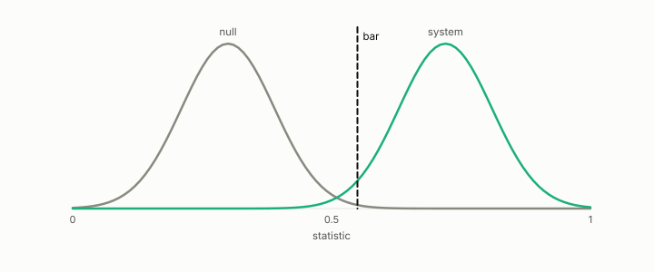

# gate

**id.** gate
**kind.** instrument

## definition

A bar that a build or a claim must pass before it proceeds, with the bar and the null written down first. Chapter 8 section 8.3 and chapter 11 section 11.6.

**Example.** The build gate required anti-hub recall of at least 0.90 in every stratum; the compressed index read 0.663 and failed.

## equation

Book equation 12.3.

    \text{validated}\iff \mathrm{AUROC}_{\text{cross}}-\max\big(\mathrm{AUROC}_{\text{untrained}},\ \mathrm{AUROC}_{\text{BoW}}\big)\ \ge\ 0.10.

## conditions

- A bar that a build or a claim must pass before it proceeds, with the bar and the null written down first. Passing a higher bar passes every lower one, a gate discriminates only when the null fails it and the real system passes it, and a gate the null passes is vacuous.
- The hubness gate was predicted to be blind to the category mix and was not, so the instrument claim was withdrawn, and the gate meta-rule says relative contrast discriminates nothing.

Conditions are curated in `entries.toml` rather than read from a record.

## ledger

none

## first stated

Chapter 8 section 8.3 of *Data Mining as Observation*, with the build gate in `turboquant-pro/docs/HUBNESS_PRIMER.md:86-131` and the cross-corpus gate in `xbse/README.md:130-160`.

## measurements

| Where the book states it | Numbers, as the book's sources table records them | Source |
|---|---|---|
| chapter 10 section 10.5 | Gate A design error, A prime skew 3.970 to 3.177, max 287 to 213, Robin Hood 0.372 to 0.261, fraction 0.117 to 0.079, compressed path 0.663 vs 0.90, seven strata, 0.62 to 0.69 vs 0.76 to 0.84 | [`turboquant-pro/docs/RESULTS_strata_phase23_gates.md:1-45`](https://github.com/ahb-sjsu/turboquant-pro/blob/856c4cb/docs/RESULTS_strata_phase23_gates.md#L1-L45) |
| chapter 11 section 11.6 | anti-hub recall, p05, hub-rank correlation, hub-set overlap, the build gate | [`turboquant-pro/docs/HUBNESS_PRIMER.md:86-131`](https://github.com/ahb-sjsu/turboquant-pro/blob/856c4cb/docs/HUBNESS_PRIMER.md#L86-L131) |
| chapter 12 section 12.5 | the gate, both nulls, margin 0.10, scorecard 0.622 to 0.853, bag of words 0.46 to 0.54, rights 0.509 vs 0.512 and 0.467 | `xbse\README.md:130-160,195-219` |

## failures and corrections

none

## invariance envelope

none declared

## machine checked

[`lean/DataMiningAsObservation/Bar.lean`](https://github.com/ahb-sjsu/observation-data-mining/blob/f3914f0/lean/DataMiningAsObservation/Bar.lean), theorems `passes_anti`, `passes_mono`, `discriminates_iff`, `no_bar_of_null_ge`, `exists_bar_of_lt`, `vacuous_of_null_passes`, at observation-data-mining f3914f0; what the check covers is stated in the book's [appendix C](https://github.com/ahb-sjsu/observation-data-mining/blob/f3914f0/chapters/machine_checked.md).

[`lean/DataMiningAsObservation/CrossCorpusGate.lean`](https://github.com/ahb-sjsu/observation-data-mining/blob/f3914f0/lean/DataMiningAsObservation/CrossCorpusGate.lean), theorems `clears_bow`, `clears_untrained`, `not_validated_of_saturated`, `margin_example`, `validated_comp`, at observation-data-mining f3914f0; what the check covers is stated in the book's [appendix C](https://github.com/ahb-sjsu/observation-data-mining/blob/f3914f0/chapters/machine_checked.md).

## used in

*Data Mining as Observation* chapters 0, 4, 8, 9, 10, 11, 12, 13, 14.

## related

bar, cross-corpus-gate, anti-hub-recall, preregistration, null-model

## see also

Book equations stated beside the entry's terms, not defining it: 10.7, 8.3.

Ledger rows that cite the entry's records without naming it: NEG-14, GO-B-legal (035→036).

Sources-table rows that share a record with the entry without naming it: chapter 10 section 10.2, chapter 10 section 10.5.

## status

Generated 2026-09-12 by `encyclopedia/generate.py`; book at observation-data-mining f3914f0; the commit of every record is listed in the encyclopedia's provenance.
