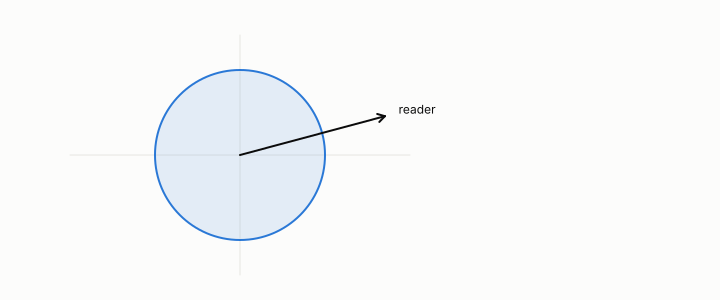

# Gaussian

**id.** gaussian
**kind.** concept

## definition

The normal distribution, in many dimensions the one whose density falls with the Mahalanobis distance. An isotropic Gaussian has every direction the same. Chapter 9 and chapter 10.

**Example.** Values 1, 2, and 3 from a normal distribution with mean 2 and spread 1 have z-scores −1, 0, and 1.

## equation

none

## conditions

- The normal distribution, in many dimensions the one with density falling with the Mahalanobis distance. An isotropic Gaussian has every direction the same, so every reader reads the same variance and no code can flip, and whitening turns any Gaussian into an isotropic one.
- The isotropic Gaussian is the control on which hub typing correlated above 0.8 with nothing, and the Gaussian pass of GO-8 was five of five with the control-statistic caveat.

Conditions are curated in `entries.toml` rather than read from a record.

## ledger

- *measures.* GO-8 `[replicated]`. On two independent source families (binary Markov; Gaussian AR(1)), a fixed stored record's operational reset threshold rises with the age of the retained side information exactly as the staleness–work complement prices it: same record, … [`geometric-observation/claims/LEDGER.md:71`](https://github.com/ahb-sjsu/geometric-observation/blob/0792c84/claims/LEDGER.md#L71).

## first stated

Chapter 9 section 9.3 and chapter 10 section 10.3 of *Data Mining as Observation*, with the isotropic Gaussian control in `turboquant-pro/turboquant_pro/anatomy.py:98-170`.

## measurements

| Where the book states it | Numbers, as the book's sources table records them | Source |
|---|---|---|
| chapter 10 section 10.3 | hierarchical typing, tails 0.95 and 0.85, prescriptions, two designs that died, correlation above 0.8 on an isotropic Gaussian | [`turboquant-pro/turboquant_pro/anatomy.py:98-170`](https://github.com/ahb-sjsu/turboquant-pro/blob/856c4cb/turboquant_pro/anatomy.py#L98-L170) |
| chapter 13 section 13.5 | GO-8, 0.10 to 0.55 across ages 0 to 64, flip probability 0.05, 1 percent to 100 percent at age 32, Gaussian pass 5 of 5, the control-statistic caveat | [`geometric-observation/claims/LEDGER.md`](https://github.com/ahb-sjsu/geometric-observation/blob/0792c84/claims/LEDGER.md) row GO-8; [`geometric-observation/experiments/GO-landauer-gaussian-secondsettings-NOTES.md`](https://github.com/ahb-sjsu/geometric-observation/blob/0792c84/experiments/GO-landauer-gaussian-secondsettings-NOTES.md) |

## failures and corrections

none

## invariance envelope

none declared

## machine checked

[`lean/DataMiningAsObservation/Isotropy.lean`](https://github.com/ahb-sjsu/observation-data-mining/blob/95af30c/lean/DataMiningAsObservation/Isotropy.lean), theorems `isotropic_reads_same`, `isotropic_no_flip`, `anisotropic_readers_differ`, `flip_iff_anisotropic`, at observation-data-mining 95af30c; what the check covers is stated in the book's [appendix C](https://github.com/ahb-sjsu/observation-data-mining/blob/95af30c/chapters/machine_checked.md).

[`lean/DataMiningAsObservation/Mahalanobis.lean`](https://github.com/ahb-sjsu/observation-data-mining/blob/95af30c/lean/DataMiningAsObservation/Mahalanobis.lean), theorems `dM2_nonneg`, `dM2_mean`, `dM2_scale`, `dM2_eq_whitened`, `dM2_antitone_in_variance`, at observation-data-mining 95af30c; what the check covers is stated in the book's [appendix C](https://github.com/ahb-sjsu/observation-data-mining/blob/95af30c/chapters/machine_checked.md).

## used in

*Data Mining as Observation* chapters 9, 10, 11, 13.

## related

isotropic, mahalanobis-distance, null-model, whitening, standard-error

## see also

Book equations stated beside the entry's terms, not defining it: 0.33, 0.6, 9.3.

Ledger rows that cite the entry's records without naming it: GO-3.

## status

Generated 2026-09-08 by `encyclopedia/generate.py`; book at observation-data-mining 95af30c; the commit of every record is listed in the encyclopedia's provenance.
