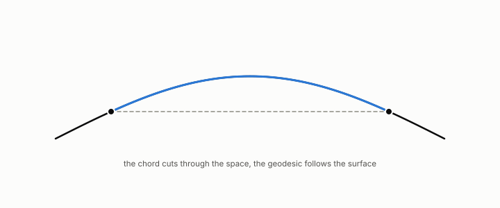

# geodesic distance

**id.** geodesic-distance
**kind.** concept

## definition

The length of the shortest path along edges between two nodes of a graph. Chapter 0 section 0.10.

**Example.** On a circle of radius 1, two points a quarter turn apart are 1.414 apart through the plane and 1.571 apart along the circle.

## equation

Book equation 3.2.

    R(i,j)=\sum_{k\ge2}\frac1{\lambda_k}\left(\frac{u_k(i)}{\sqrt{d_i}}-\frac{u_k(j)}{\sqrt{d_j}}\right)^{2}\ \longrightarrow\ \frac1{d_i}+\frac1{d_j}\quad(n\to\infty,\ \dim\ge3).

Book equation 3.3.

    X_i=r_i\,\theta_i,\qquad r_i\ \to\ \frac1{\sqrt{d_i}},\qquad \theta_i=\frac{X_i}{\|X_i\|}\in S^{m-1}.

## conditions

- The length of the shortest path along edges between two nodes. It is zero from a node to itself, symmetric, one between adjacent nodes, and on a connected graph obeys the triangle inequality.
- The geodesic-rank reader reads only the ordering of these distances, so a strictly increasing transform of them leaves its nearest neighbour unchanged. That the angle of the spectral embedding carries the ordering and the radius carries degree is the measured claim of chapter 3, with the refuted commute-filter row beside it.

Conditions are curated in `entries.toml` rather than read from a record.

## ledger

none

## first stated

Chapter 0 section 0.10 and chapter 3 section 3.3 of *Data Mining as Observation*, with the geodesic-rank reader of Volume 14 chapter 9, `geometric-observation/chapters/ch09_legibility.md:10-41`.

## measurements

| Where the book states it | Numbers, as the book's sources table records them | Source |
|---|---|---|
| chapter 3 section 3.3 | row normalization is the projection onto the read subspace of the geodesic-rank consumer | [`geometric-observation/chapters/ch09_legibility.md:31-41`](https://github.com/ahb-sjsu/geometric-observation/blob/fc6b378/chapters/ch09_legibility.md#L31-L41); [`geometric-observation/chapters/ch03_historical_precursors.md:98-110`](https://github.com/ahb-sjsu/geometric-observation/blob/fc6b378/chapters/ch03_historical_precursors.md#L98-L110) |
| chapter 9 section 9.1 | the geodesic-rank reader discards the radius, row normalization is the angular projection | [`geometric-observation/chapters/ch09_legibility.md:10-41`](https://github.com/ahb-sjsu/geometric-observation/blob/fc6b378/chapters/ch09_legibility.md#L10-L41); `the-angular-observer/theorem.md:110-146` |

## failures and corrections

none

## invariance envelope

none declared

## machine checked

[`lean/DataMiningAsObservation/GeodesicDistance.lean`](https://github.com/ahb-sjsu/observation-data-mining/blob/f3914f0/lean/DataMiningAsObservation/GeodesicDistance.lean), theorems `dist_self`, `dist_comm`, `dist_triangle`, `dist_adj`, `geodesic_rank_invariant`, at observation-data-mining f3914f0; what the check covers is stated in the book's [appendix C](https://github.com/ahb-sjsu/observation-data-mining/blob/f3914f0/chapters/machine_checked.md).

## used in

*Data Mining as Observation* chapters 0, 3, 9, 10.

## related

rank-faithful, laplacian, recognizer, bi-lipschitz

## see also

Book equations stated beside the entry's terms, not defining it: 0.20.

Ledger rows that cite the entry's records without naming it: GO-3, NEG-1.

Sources-table rows that share a record with the entry without naming it: chapter 3 section 3.2, chapter 3 section 3.3, chapter 9 section 9.2, chapter 11 section 11.1.

## status

Generated 2026-09-10 by `encyclopedia/generate.py`; book at observation-data-mining f3914f0; the commit of every record is listed in the encyclopedia's provenance.
