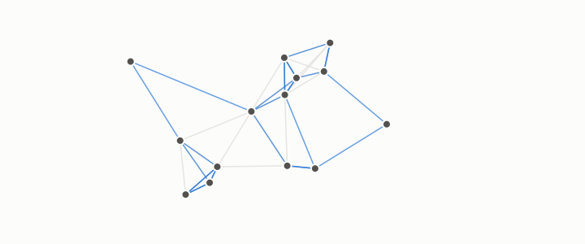

# graph

**id.** graph
**kind.** concept

## definition

A set of nodes and a set of edges joining pairs of them. A neighbourhood graph joins each row of a dataset to its nearest rows. Chapter 0 section 0.10.

**Example.** Four nodes joined in a square have four edges, and every node has degree 2.

## equation

Book equation 0.19.

    L=I-D^{-1/2}AD^{-1/2},\qquad D=\operatorname{diag}(d_1,\dots,d_n),\qquad L\,u_k=\lambda_k u_k,\ \ 0=\lambda_1\le\lambda_2\le\cdots.

Book equation 0.20.

    \Psi_i=\left(\frac{u_k(i)}{\sqrt{\lambda_k\,d_i}}\right)_{k\ge2},\qquad \|\Psi_i-\Psi_j\|^{2}=R(i,j)=\frac{C(i,j)}{\operatorname{vol}(G)}.

## conditions

- A set of nodes and a set of edges joining pairs of them. A neighbourhood graph joins each row to its k nearest rows, so every node has exactly k out-neighbours. The mutual form keeps an edge only when each node is among the other's neighbours, is symmetric, is a subgraph of the directed form, and gives no node more than k mutual neighbours.
- The Laplacian of the graph carries the dimension in its eigenvalue count and the geodesic ranking in its low eigenvectors' angles, which is what chapters 3 and 9 read.

Conditions are curated in `entries.toml` rather than read from a record.

## ledger

none

## first stated

Chapter 0 section 0.10 of *Data Mining as Observation*, with the neighbourhood graphs of the-angular-observer and the recognizer battery.

## measurements

none

## failures and corrections

none

## invariance envelope

none declared

## machine checked

[`lean/DataMiningAsObservation/Graph.lean`](https://github.com/ahb-sjsu/observation-data-mining/blob/95af30c/lean/DataMiningAsObservation/Graph.lean), theorems `outDegree`, `mutual_symm`, `mutual_sub`, `mutualNbrs_card_le`, `mem_mutualNbrs`, at observation-data-mining 95af30c; what the check covers is stated in the book's [appendix C](https://github.com/ahb-sjsu/observation-data-mining/blob/95af30c/chapters/machine_checked.md).

## used in

*Data Mining as Observation* chapters 0, 3, 9, 10, 11.

## related

degree, laplacian, geodesic-distance, spectral-embedding, manifold

## see also

Ledger rows that cite the entry's records without naming it: GO-3, NEG-1.

Sources-table rows that share a record with the entry without naming it: chapter 3 section 3.2, chapter 3 section 3.3, chapter 9 section 9.1, chapter 9 section 9.2, chapter 11 section 11.1.

## status

Generated 2026-09-09 by `encyclopedia/generate.py`; book at observation-data-mining 95af30c; the commit of every record is listed in the encyclopedia's provenance.
