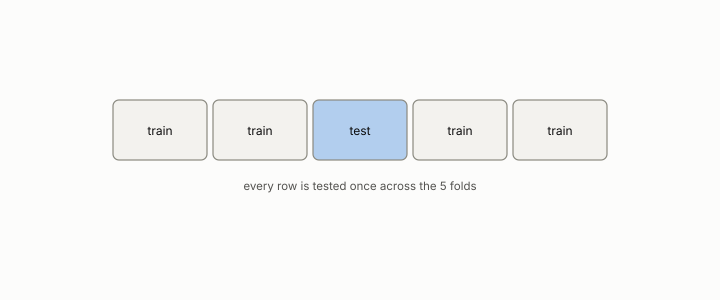

# harness

**id.** harness
**kind.** concept

## definition

The code that evaluates a model. It is itself a consumer with a read subspace, and chapter 8 shows how it reads the test fold when allowed to.

**Example.** Ten folds, five seeds, and 100 samples per fold is a budget of 5000 reads of the data.

## equation

Book equation 8.1.

    O_{\mathrm{harness}}=\big(C_{\mathrm{score}},\ G_{\mathrm{metric}},\ B=\text{folds}\times\text{samples}\times\text{seeds}\big).

## conditions

- The harness is the code that evaluates a model, and it is a consumer with its own read subspace, its output metric, and a budget of folds, samples, and seeds. What it reads decides what the reported score measures.
- A harness that is allowed to see the test fold, through feature selection before the split, through repeated selection on one split, or through a metric that discriminates nothing, reports a score of itself.
- Repeated cross-validation folds are not independent, so the variance of a fold mean is understated unless corrected, and the program's own retracted comparison is the case.

Conditions are curated in `entries.toml` rather than read from a record.

## ledger

none

## first stated

Chapter 8 section 8.1 of *Data Mining as Observation*, with the program's own harness failures in `openvector-bench/results/QUERY_COUPLING_ARTIFACT.md:1-20` and `constraint-gap/review/FINDINGS.md:1-35`.

## measurements

none

## failures and corrections

- [`theory-radar/paper/REVISION_PLAN.md:39-45`](https://github.com/ahb-sjsu/theory-radar/blob/37c4e6c/paper/REVISION_PLAN.md#L39-L45) at 37c4e6c. **Fix:** - Drop "σ significance" everywhere - Report: mean ΔF1, std, 95% CI, and corrected resampled t-statistic - Table columns: "Test F1", "GB F1", "ΔF1", "95% CI", "Direction" - Text: "the formula outperforms GB by ΔF1=0.031, 95% CI [0.028, 0.034]" - Add Nadeau-Bengio corrected t-test (accounts for CV fold correlation) - Keep effect size as supplementary but don't call it "σ"

## invariance envelope

none declared

## machine checked

[`lean/DataMiningAsObservation/Bonferroni.lean`](https://github.com/ahb-sjsu/observation-data-mining/blob/c149a10/lean/DataMiningAsObservation/Bonferroni.lean), theorems `family_error_le`, `bonferroni`, `one_look`, at observation-data-mining c149a10; what the check covers is stated in the book's [appendix C](https://github.com/ahb-sjsu/observation-data-mining/blob/c149a10/chapters/machine_checked.md).

## used in

*Data Mining as Observation* chapters 1, 2, 4, 6, 7, 8, 10, 12, 14.

## related

leakage, observer, preregistration, ledger-class

## see also

Book equations stated beside the entry's terms, not defining it: 8.2, 8.3.

Ledger rows that cite the entry's records without naming it: OT-11, NEG-2, NEG-4.

Sources-table rows that share a record with the entry without naming it: chapter 1 section 1.4, chapter 2 section 2.5, chapter 3 section 3.2, chapter 6 section 6.4, chapter 8 section 8.1, chapter 8 section 8.2, chapter 8 section 8.4, chapter 8 section 8.5, chapter 11 section 11.1, chapter 11 section 11.2.

## status

Generated 2026-09-09 by `encyclopedia/generate.py`; book at observation-data-mining c149a10; the commit of every record is listed in the encyclopedia's provenance.
