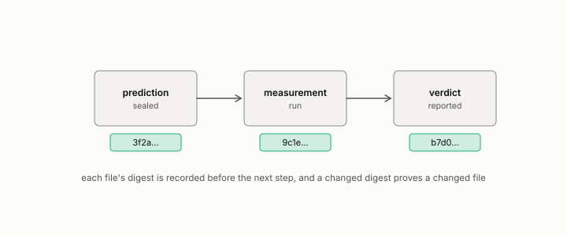

# hash

**id.** hash
**kind.** instrument

## definition

A short fixed-length fingerprint of a file, computed so that any change to the file changes the fingerprint. Chapter 0 section 0.12.

**Example.** Changing one byte of a file changes its SHA-256 digest, and two files with different digests are different files.

## equation

none

## conditions

- A short fixed-length fingerprint of a file, computed so that any change to the file changes the fingerprint. A changed hash proves a changed file, an unchanged file has an unchanged hash, and a digest with fewer values than there are files sends two distinct files to the same digest, so an equal hash is evidence and not proof.
- The seal ledger records the hash beside the commit, and the recognizer's templates and the probe's records carry theirs, so that a reader with the repository can check what was fixed before the measurement.
- A hash proves content and not time. When a file existed in the hashed state is established by a public push, a signed tag, a transparency log, or an archival deposit.

Conditions are curated in `entries.toml` rather than read from a record.

## ledger

none

## first stated

Chapter 0 section 0.12 of *Data Mining as Observation*, with the program's seal ledger, `observation-theory-campaigns/experiments/SEALS.md:1-10`, where every seal records a SHA-256.

## measurements

none

## failures and corrections

none

## machine checked

[`lean/DataMiningAsObservation/Seal.lean`](https://github.com/ahb-sjsu/observation-data-mining/blob/95af30c/lean/DataMiningAsObservation/Seal.lean), theorems `changed_of_hash_ne`, `hash_eq_of_eq`, `exists_collision`, at observation-data-mining 95af30c; what the check covers is stated in the book's [appendix C](https://github.com/ahb-sjsu/observation-data-mining/blob/95af30c/chapters/machine_checked.md).

## used in

*Data Mining as Observation* chapters 0, 1, 2, 3, 4, 5, 6, 7, 8, 9, 10, 11, 12, 13, 14.

## related

sealed, preregistration, ledger-class, certificate

## see also

Book equations stated beside the entry's terms, not defining it: 8.3.

Ledger rows that cite the entry's records without naming it: OT-7.

## status

Generated 2026-09-07 by `encyclopedia/generate.py`; book at observation-data-mining 95af30c; the commit of every record is listed in the encyclopedia's provenance.
