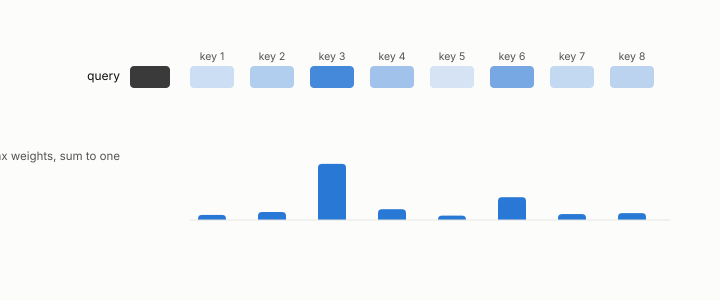

# head

**id.** head
**kind.** concept

## definition

One attention operation. A model has many, each with its own queries, keys, and values. Chapter 0 section 0.11.

**Example.** One head reads a query against 512 keys and returns one weighted mix of the values.

## equation

Book equation 0.23.

    \operatorname{softmax}(z)_i=\frac{e^{z_i}}{\sum_j e^{z_j}},\qquad \text{output}=\sum_i\operatorname{softmax}\!\Big(\frac{q\cdot k_i}{\sqrt{d}}\Big)_{\!i}\,v_i.

## conditions

- One attention operation, with its own queries, keys, and values. A head's output lies between the smallest and largest value, it reads the keys only through their scores against its query, and a key change the query does not read leaves its output unchanged however large the change.
- Each head has its own read subspace, a few query-weighted directions of each key, so a compression that serves one head can fail another, and the serving-stack measurement of chapter 13 is per head.

Conditions are curated in `entries.toml` rather than read from a record.

## ledger

none

## first stated

Chapter 0 section 0.11 of *Data Mining as Observation*, with the program's head-level measurements in `turboquant-pro/docs/KV_KEYS_FINDING.md:1-49` and the planted probe of chapter 6.

## measurements

| Where the book states it | Numbers, as the book's sources table records them | Source |
|---|---|---|
| chapter 11 section 11.2 | fp16 12.24, values-only 13.12, PolarQuant K4 10643 and 0.095, per-channel uniform K4 14.91 and 0.062, per-channel NUQ K3 15.77 and 0.148, 2.4x and 670x, pre-rotary near 22000, 2 key heads serve 12 query heads | [`turboquant-pro/docs/KV_KEYS_FINDING.md:1-49`](https://github.com/ahb-sjsu/turboquant-pro/blob/856c4cb/docs/KV_KEYS_FINDING.md#L1-L49) |

## failures and corrections

none

## invariance envelope

none declared

## machine checked

[`lean/DataMiningAsObservation/Attention.lean`](https://github.com/ahb-sjsu/observation-data-mining/blob/95af30c/lean/DataMiningAsObservation/Attention.lean), theorems `output_le_max`, `min_le_output`, `output_congr`, `output_nuisance`, at observation-data-mining 95af30c; what the check covers is stated in the book's [appendix C](https://github.com/ahb-sjsu/observation-data-mining/blob/95af30c/chapters/machine_checked.md).

## used in

*Data Mining as Observation* chapters 0, 1, 2, 4, 6, 7, 8, 11, 12, 13.

## related

attention, kv-cache, read-subspace, softmax

## see also

Book equations stated beside the entry's terms, not defining it: 11.1.

Ledger rows that cite the entry's records without naming it: GO-2/GO-12/GO-13 operational (KV serving, 077), NEG-2.

Sources-table rows that share a record with the entry without naming it: chapter 1 section 1.4, chapter 2 section 2.5, chapter 3 section 3.2, chapter 8 section 8.2, chapter 11 section 11.1, chapter 11 section 11.2.

## status

Generated 2026-09-08 by `encyclopedia/generate.py`; book at observation-data-mining 95af30c; the commit of every record is listed in the encyclopedia's provenance.
