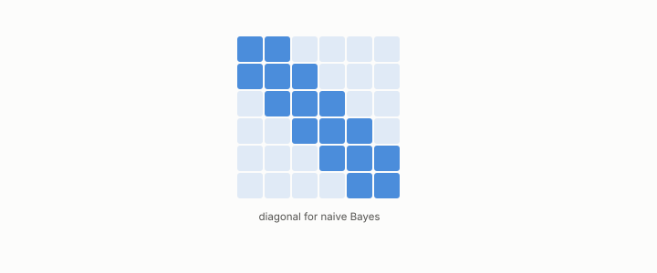

# Hessian

**id.** hessian
**kind.** concept

## definition

The matrix of second derivatives of a score, whose off-diagonal entries are the interactions. Naive Bayes has a diagonal one. Chapter 6.

**Example.** For the score 3x1 + 2x2 + x1 x2 the Hessian has 1 off the diagonal; for naive Bayes it has 0.

## equation

none

## conditions

- The matrix of second derivatives of a score, whose off-diagonal entries are the interactions. The second difference recovers a quadratic's curvature exactly, and a score that is additive across features, naive Bayes, has a diagonal Hessian because one feature's contribution is the same whatever the others are.
- The read operator is not the Hessian. Two features' sensitivities can rise and fall together across rows even when neither changes the other's effect, so a diagonal Hessian does not give a diagonal read operator.

Conditions are curated in `entries.toml` rather than read from a record.

## ledger

- *measures.* GO-B-optim-D4 (034 · D4) `[predicted]`. Optimization — gradient compression, curvature (Hessian) read operator, on a REAL model (logistic regression); optional stretch [`geometric-observation/claims/LEDGER.md:122`](https://github.com/ahb-sjsu/geometric-observation/blob/fc6b378/claims/LEDGER.md#L122).

## first stated

Chapter 6 section 6.1 and chapter 7 section 7.2 of *Data Mining as Observation*, with the exact Hessian of a real logistic model in `geometric-observation/claims/LEDGER.md` row GO-B-optim-D4.

## measurements

| Where the book states it | Numbers, as the book's sources table records them | Source |
|---|---|---|
| chapter 7 section 7.2 | real logistic model, exact Hessian, anti 300 of 300, flip 82 of 300, coupling diagnosis, bound not refutation | [`geometric-observation/claims/LEDGER.md`](https://github.com/ahb-sjsu/geometric-observation/blob/fc6b378/claims/LEDGER.md) row GO-B-optim-D4 |

## failures and corrections

none

## invariance envelope

none declared

## machine checked

[`lean/DataMiningAsObservation/Curvature.lean`](https://github.com/ahb-sjsu/observation-data-mining/blob/c149a10/lean/DataMiningAsObservation/Curvature.lean), theorems `second_quad`, `second_affine`, `linear_error`, `gradient_change`, at observation-data-mining c149a10; what the check covers is stated in the book's [appendix C](https://github.com/ahb-sjsu/observation-data-mining/blob/c149a10/chapters/machine_checked.md).

[`lean/DataMiningAsObservation/NaiveBayes.lean`](https://github.com/ahb-sjsu/observation-data-mining/blob/c149a10/lean/DataMiningAsObservation/NaiveBayes.lean), theorems `log_likelihood_sum`, `log_odds_sum`, `contribution_independent`, at observation-data-mining c149a10; what the check covers is stated in the book's [appendix C](https://github.com/ahb-sjsu/observation-data-mining/blob/c149a10/chapters/machine_checked.md).

## used in

*Data Mining as Observation* chapters 6, 7, 14.

## related

curvature, naive-bayes, boosting, read-operator, jacobian

## see also

Book equations stated beside the entry's terms, not defining it: 6.1, 0.9.

Sources-table rows that share a record with the entry without naming it: chapter 7 section 7.2.

## status

Generated 2026-09-09 by `encyclopedia/generate.py`; book at observation-data-mining c149a10; the commit of every record is listed in the encyclopedia's provenance.
