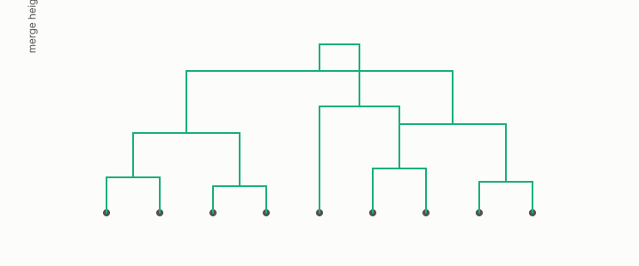

# hierarchical clustering

**id.** hierarchical-clustering
**kind.** instrument

## definition

A clustering that merges the closest pair of clusters at each step, under a linkage that reads the nearest pair, the farthest, or the average, so that merge heights never decrease. Chapter 9.

## equation

Book equation 9.1.

    \mathrm{SSE}=\sum_{k=1}^{K}\sum_{i\in\mathcal C_k}\|x_i-c_k\|^{2},\qquad\text{the }P_C=I\text{ distortion summed within clusters}.

## conditions

- A clustering that merges the closest pair of clusters at each step under a linkage that reads the nearest pair, the farthest pair, or the average. When the merged pair was the closest at some height, no updated distance falls below it, so the merge heights never decrease, single linkage is never above complete, and average linkage lies between them.
- The dendrogram inherits the distance's quotient at every level, so the tree is a certificate about the chosen quotient and not about the data.

Conditions are curated in `entries.toml` rather than read from a record.

## ledger

none

## first stated

Chapter 9 section 9.1 of *Data Mining as Observation*, after TSK chapter 7.

## measurements

none

## failures and corrections

none

## machine checked

`lean/DataMiningAsObservation/Hierarchical.lean`, theorems `single_ge`, `complete_ge`, `average_ge`, `single_le_complete`, `average_between`, at observation-data-mining 08b4794.

## used in

*Data Mining as Observation* chapters 9.

## related

k-means, dbscan, euclidean-distance, validity-index, quotient

## see also

Book equations stated beside the entry's terms, not defining it: 3.1.

Sources-table rows that share a record with the entry without naming it: chapter 9 section 9.1, chapter 10 section 10.1.

## status

Generated 2026-09-06 by `encyclopedia/generate.py`; book at observation-data-mining 08b4794; the commit of every record is listed in the encyclopedia's provenance.
