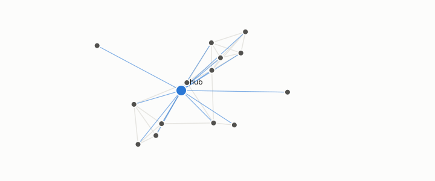

# hub

**id.** hub
**kind.** concept

## definition

A row retrieved as a nearest neighbour far more often than chance allows. The book shows hubness is almost entirely a property of the queries and the reader, not of the corpus. Chapters 3 and 10.

**Example.** One row appeared in 287 of the queries' neighbour lists, far above what chance allows.

## equation

Book equation 10.3.

    N_k(x\mid Q)=\big|\{q\in Q:\ x\in\operatorname{top}_k(q)\}\big|,\qquad \text{anti-hub}:\ N_k(x)=0.

Book equation 10.5.

    \begin{gathered} \text{central}:\ \mathrm{pct}_{\mathrm{centrality}}\ge0.95; \\ \text{dense}:\ \neg\text{central}\ \wedge\ \mathrm{pct}_{\mathrm{density}}\ge0.85; \qquad \text{prescribe by }f_{\mathrm{central}},\ f_{\mathrm{dense}}\ \text{at}\ 0.75. \end{gathered}

## conditions

- A row retrieved as a nearest neighbour far more often than chance allows, a count above the Poisson ceiling. Since the counts sum to the slots handed out, the number of rows with count above a ceiling is at most the slots over the ceiling plus one, so hubs are few by arithmetic, and a higher ceiling names fewer of them.
- Whether a row is a hub depends on the queries and the retrieval rule alone, which is the sense in which hubness is a query property, and the program's first hub counts fell by a factor of several when query coupling was removed.

Conditions are curated in `entries.toml` rather than read from a record.

## ledger

- *refutes or corrects.* NEG-11 `[refuted]`. (GO-5, prospective ×4) The α=1 density/hubness quotient decisively and density-specifically restores invariant fidelity in a non-spectral domain. [`geometric-observation/claims/LEDGER.md:104`](https://github.com/ahb-sjsu/geometric-observation/blob/fc6b378/claims/LEDGER.md#L104).

## first stated

Radovanović, Nanopoulos, and Ivanović, hubs in space, 2010, as chapter 3 section 3.5 of *Data Mining as Observation* reads it, with the program's finding in openvector-bench that hubness is a query property, `openvector-bench/results/QUERY_COUPLING_ARTIFACT.md:1-20`.

## measurements

| Where the book states it | Numbers, as the book's sources table records them | Source |
|---|---|---|
| chapter 3 section 3.5 | Poisson null, hub excess, budget parameter | `openvector-bench/openvector_bench/hubness.py:41-100` |
| chapter 10 section 10.2 | anti-hubs as where compressed indexes fail first, aggregate recall barely moves | [`turboquant-pro/docs/HUBNESS_PRIMER.md:86-131`](https://github.com/ahb-sjsu/turboquant-pro/blob/856c4cb/docs/HUBNESS_PRIMER.md#L86-L131) |
| chapter 11 section 11.6 | count of ten, hubs and anti-hubs, max 78 vs 369, density correlation about 0.67, 8 percent vs 34 percent, abstain below 2.5k, centering vs mutual-proximity rescaling | `turboquant-pro\docs\HUBNESS_PRIMER.md:1-60,60-170` |
| chapter 11 section 11.6 | anti-hub recall, p05, hub-rank correlation, hub-set overlap, the build gate | [`turboquant-pro/docs/HUBNESS_PRIMER.md:86-131`](https://github.com/ahb-sjsu/turboquant-pro/blob/856c4cb/docs/HUBNESS_PRIMER.md#L86-L131) |

## failures and corrections

- NEG-11, `[refuted]`. (GO-5, prospective ×4) The α=1 density/hubness quotient decisively and density-specifically restores invariant fidelity in a non-spectral domain. [`geometric-observation/claims/LEDGER.md:104`](https://github.com/ahb-sjsu/geometric-observation/blob/fc6b378/claims/LEDGER.md#L104).

## invariance envelope

none declared

## machine checked

[`lean/DataMiningAsObservation/Hub.lean`](https://github.com/ahb-sjsu/observation-data-mining/blob/f3914f0/lean/DataMiningAsObservation/Hub.lean), theorems `card_hubs_le`, `hubs_congr`, `hubs_anti`, `hubs_empty`, at observation-data-mining f3914f0; what the check covers is stated in the book's [appendix C](https://github.com/ahb-sjsu/observation-data-mining/blob/f3914f0/chapters/machine_checked.md).

## used in

*Data Mining as Observation* chapters 0, 1, 3, 5, 10, 11, 12, 13.

## related

hubness, poisson-ceiling, anti-hub, robin-hood-index, null-model

## see also

Book equations stated beside the entry's terms, not defining it: 0.17.

Ledger rows that cite the entry's records without naming it: NEG-14.

Sources-table rows that share a record with the entry without naming it: chapter 3 section 3.5, chapter 8 section 8.1, chapter 10 section 10.3, chapter 11 section 11.6.

## status

Generated 2026-09-09 by `encyclopedia/generate.py`; book at observation-data-mining f3914f0; the commit of every record is listed in the encyclopedia's provenance.
